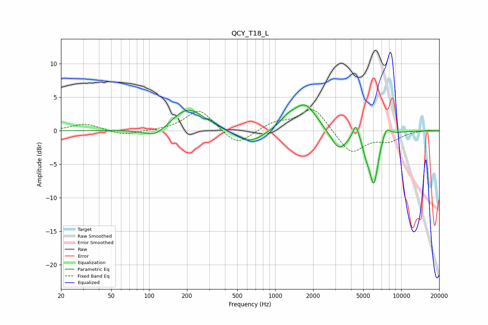

# QCY_T18_L
See [usage instructions](https://github.com/jaakkopasanen/AutoEq#usage) for more options and info.

### Parametric EQs
Apply preamp of -3.9 dB when using parametric equalizer.

|   # | Type    |   Fc (Hz) |    Q |   Gain (dB) |
|-----|---------|-----------|------|-------------|
|   1 | Peaking |       112 | 1.62 |        -1.5 |
|   2 | Peaking |       204 | 1.1  |         3.5 |
|   3 | Peaking |       625 | 1.25 |        -2   |
|   4 | Peaking |      1257 | 2.25 |         1.2 |
|   5 | Peaking |      1729 | 1.55 |         4   |
|   6 | Peaking |      3202 | 2.17 |        -3   |
|   7 | Peaking |      4366 | 5.96 |         2.4 |
|   8 | Peaking |      5264 | 6    |        -1.3 |
|   9 | Peaking |      6050 | 3.71 |        -7.8 |
|  10 | Peaking |      7585 | 4.19 |         1.7 |

### Fixed Band EQs
When using fixed band (also called graphic) equalizer, apply preamp of **-3.2 dB** (if available) and set gains manually with these parameters.

|   # | Type    |   Fc (Hz) |    Q |   Gain (dB) |
|-----|---------|-----------|------|-------------|
|   1 | Peaking |        31 | 1.41 |         1.1 |
|   2 | Peaking |        62 | 1.41 |        -0.7 |
|   3 | Peaking |       125 | 1.41 |         0   |
|   4 | Peaking |       250 | 1.41 |         3.3 |
|   5 | Peaking |       500 | 1.41 |        -2.3 |
|   6 | Peaking |      1000 | 1.41 |         1.2 |
|   7 | Peaking |      2000 | 1.41 |         3.6 |
|   8 | Peaking |      4000 | 1.41 |        -3.5 |
|   9 | Peaking |      8000 | 1.41 |        -1.3 |
|  10 | Peaking |     16000 | 1.41 |         0.1 |

### Graphs

