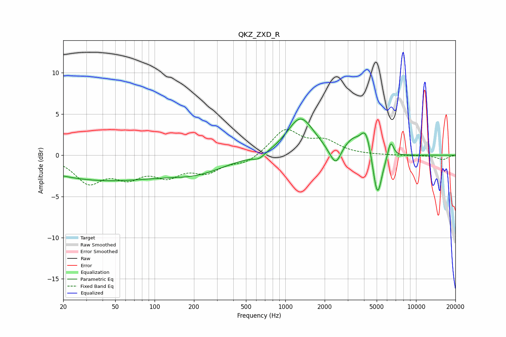

# QKZ_ZXD_R
See [usage instructions](https://github.com/jaakkopasanen/AutoEq#usage) for more options and info.

### Parametric EQs
Apply preamp of -4.5 dB when using parametric equalizer.

|   # | Type    |   Fc (Hz) |    Q |   Gain (dB) |
|-----|---------|-----------|------|-------------|
|   1 | Peaking |        40 | 0.29 |        -3   |
|   2 | Peaking |       215 | 0.65 |        -1.6 |
|   3 | Peaking |       628 | 3.14 |        -0.6 |
|   4 | Peaking |      1308 | 1.38 |         4.6 |
|   5 | Peaking |      2237 | 3.26 |        -0.6 |
|   6 | Peaking |      2451 | 3.99 |        -1.8 |
|   7 | Peaking |      3266 | 2.24 |         1.5 |
|   8 | Peaking |      4136 | 3.38 |         3.1 |
|   9 | Peaking |      5060 | 3.94 |        -5.8 |
|  10 | Peaking |      6397 | 6    |         2.1 |

### Fixed Band EQs
When using fixed band (also called graphic) equalizer, apply preamp of **-3.2 dB** (if available) and set gains manually with these parameters.

|   # | Type    |   Fc (Hz) |    Q |   Gain (dB) |
|-----|---------|-----------|------|-------------|
|   1 | Peaking |        31 | 1.41 |        -3.1 |
|   2 | Peaking |        62 | 1.41 |        -2.2 |
|   3 | Peaking |       125 | 1.41 |        -2.1 |
|   4 | Peaking |       250 | 1.41 |        -1.8 |
|   5 | Peaking |       500 | 1.41 |        -1   |
|   6 | Peaking |      1000 | 1.41 |         3.1 |
|   7 | Peaking |      2000 | 1.41 |         1.5 |
|   8 | Peaking |      4000 | 1.41 |         0   |
|   9 | Peaking |      8000 | 1.41 |        -0   |
|  10 | Peaking |     16000 | 1.41 |        -0.5 |

### Graphs

