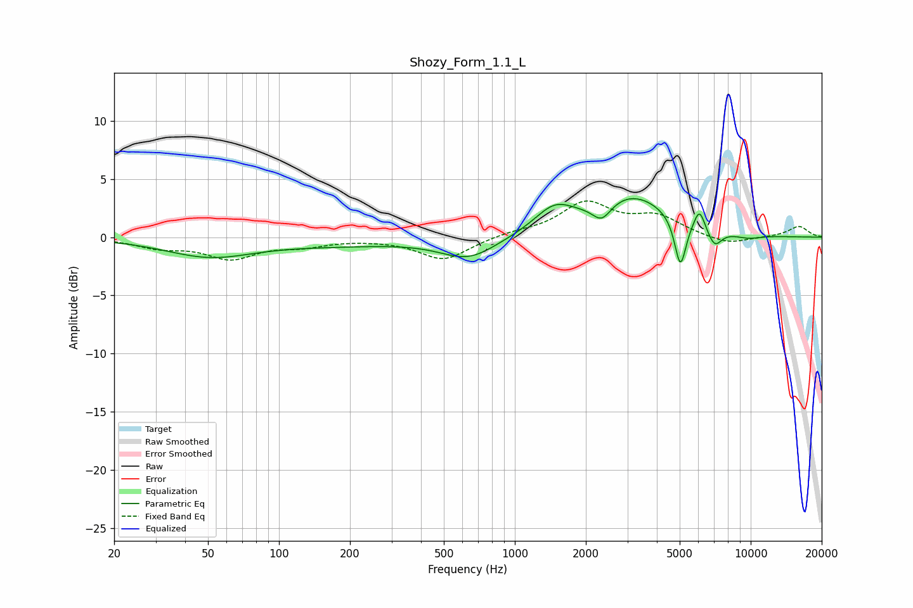

# Shozy_Form_1.1_L
See [usage instructions](https://github.com/jaakkopasanen/AutoEq#usage) for more options and info.

### Parametric EQs
Apply preamp of -3.4 dB when using parametric equalizer.

|   # | Type    |   Fc (Hz) |    Q |   Gain (dB) |
|-----|---------|-----------|------|-------------|
|   1 | Peaking |        51 | 0.76 |        -1.6 |
|   2 | Peaking |       179 | 0.5  |        -0.6 |
|   3 | Peaking |       636 | 1.19 |        -1.9 |
|   4 | Peaking |      1469 | 1.67 |         2.1 |
|   5 | Peaking |      2336 | 3.51 |        -1.5 |
|   6 | Peaking |      3134 | 0.85 |         3.5 |
|   7 | Peaking |      5033 | 5.82 |        -4.2 |
|   8 | Peaking |      6063 | 6    |         1.8 |
|   9 | Peaking |      7027 | 4.54 |        -1.5 |
|  10 | Peaking |      9706 | 2.04 |        -0.4 |

### Fixed Band EQs
When using fixed band (also called graphic) equalizer, apply preamp of **-3.2 dB** (if available) and set gains manually with these parameters.

|   # | Type    |   Fc (Hz) |    Q |   Gain (dB) |
|-----|---------|-----------|------|-------------|
|   1 | Peaking |        31 | 1.41 |        -0.8 |
|   2 | Peaking |        62 | 1.41 |        -1.7 |
|   3 | Peaking |       125 | 1.41 |        -0.6 |
|   4 | Peaking |       250 | 1.41 |        -0.1 |
|   5 | Peaking |       500 | 1.41 |        -2   |
|   6 | Peaking |      1000 | 1.41 |         0.3 |
|   7 | Peaking |      2000 | 1.41 |         2.9 |
|   8 | Peaking |      4000 | 1.41 |         1.6 |
|   9 | Peaking |      8000 | 1.41 |        -0.7 |
|  10 | Peaking |     16000 | 1.41 |         0.9 |

### Graphs

