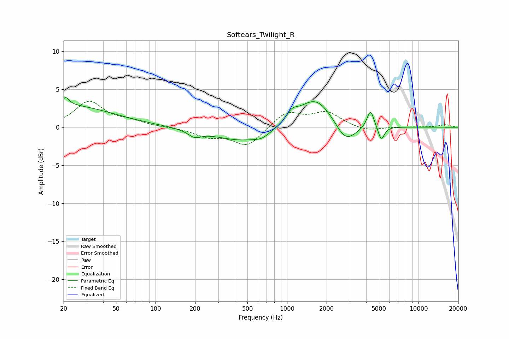

# Softears_Twilight_R
See [usage instructions](https://github.com/jaakkopasanen/AutoEq#usage) for more options and info.

### Parametric EQs
Apply preamp of -4.0 dB when using parametric equalizer.

|   # | Type    |   Fc (Hz) |    Q |   Gain (dB) |
|-----|---------|-----------|------|-------------|
|   1 | Peaking |        20 | 0.38 |         2.9 |
|   2 | Peaking |        21 | 5.65 |         1   |
|   3 | Peaking |       198 | 2.79 |        -0.9 |
|   4 | Peaking |       473 | 0.64 |        -1.9 |
|   5 | Peaking |       643 | 2.58 |        -0.5 |
|   6 | Peaking |      1089 | 3.21 |         1.2 |
|   7 | Peaking |      1647 | 1.06 |         4.1 |
|   8 | Peaking |      2788 | 1.75 |        -2.8 |
|   9 | Peaking |      4315 | 5.34 |         2.4 |
|  10 | Peaking |      5206 | 5.99 |        -1.9 |

### Fixed Band EQs
When using fixed band (also called graphic) equalizer, apply preamp of **-3.5 dB** (if available) and set gains manually with these parameters.

|   # | Type    |   Fc (Hz) |    Q |   Gain (dB) |
|-----|---------|-----------|------|-------------|
|   1 | Peaking |        31 | 1.41 |         3.3 |
|   2 | Peaking |        62 | 1.41 |         0.7 |
|   3 | Peaking |       125 | 1.41 |         0   |
|   4 | Peaking |       250 | 1.41 |        -1.1 |
|   5 | Peaking |       500 | 1.41 |        -2.5 |
|   6 | Peaking |      1000 | 1.41 |         2   |
|   7 | Peaking |      2000 | 1.41 |         1.9 |
|   8 | Peaking |      4000 | 1.41 |        -0.6 |
|   9 | Peaking |      8000 | 1.41 |         0   |
|  10 | Peaking |     16000 | 1.41 |         0.3 |

### Graphs

