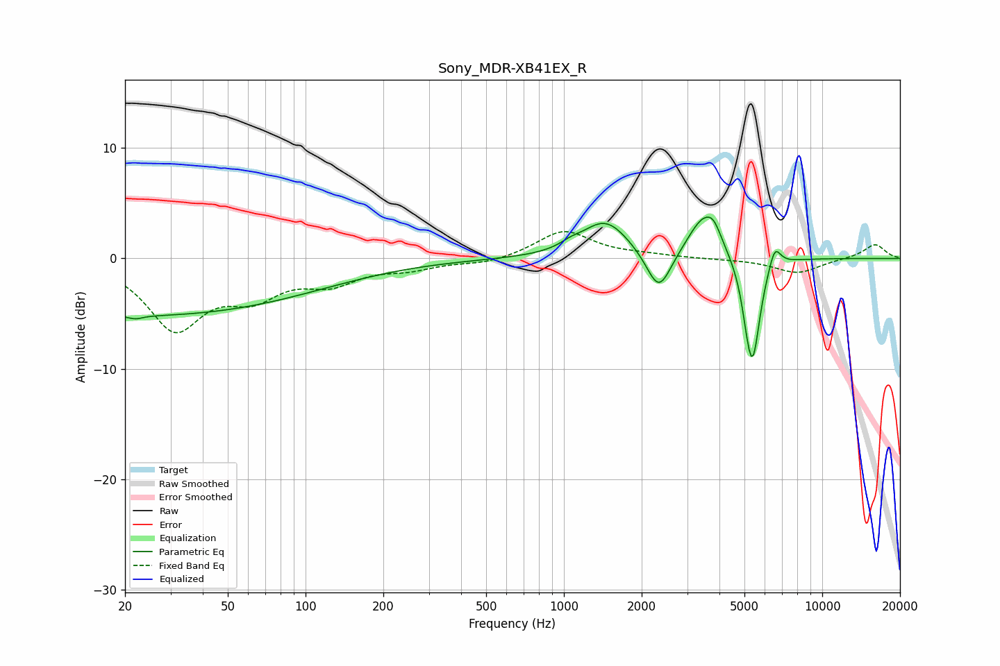

# Sony_MDR-XB41EX_R
See [usage instructions](https://github.com/jaakkopasanen/AutoEq#usage) for more options and info.

### Parametric EQs
Apply preamp of -3.8 dB when using parametric equalizer.

|   # | Type    |   Fc (Hz) |    Q |   Gain (dB) |
|-----|---------|-----------|------|-------------|
|   1 | Peaking |        22 | 5.35 |        -0.3 |
|   2 | Peaking |        22 | 0.18 |        -5.2 |
|   3 | Peaking |      1060 | 3.7  |         0.4 |
|   4 | Peaking |      1446 | 1.53 |         3.4 |
|   5 | Peaking |      2331 | 2.95 |        -3.9 |
|   6 | Peaking |      3465 | 2.27 |         3.7 |
|   7 | Peaking |      3804 | 4.73 |         1.2 |
|   8 | Peaking |      5135 | 6    |        -1.8 |
|   9 | Peaking |      5388 | 4.73 |        -8.6 |
|  10 | Peaking |      6548 | 5.97 |         2.1 |

### Fixed Band EQs
When using fixed band (also called graphic) equalizer, apply preamp of **-2.5 dB** (if available) and set gains manually with these parameters.

|   # | Type    |   Fc (Hz) |    Q |   Gain (dB) |
|-----|---------|-----------|------|-------------|
|   1 | Peaking |        31 | 1.41 |        -6.1 |
|   2 | Peaking |        62 | 1.41 |        -2.8 |
|   3 | Peaking |       125 | 1.41 |        -1.9 |
|   4 | Peaking |       250 | 1.41 |        -0.8 |
|   5 | Peaking |       500 | 1.41 |        -0.5 |
|   6 | Peaking |      1000 | 1.41 |         2.5 |
|   7 | Peaking |      2000 | 1.41 |         0.2 |
|   8 | Peaking |      4000 | 1.41 |        -0.1 |
|   9 | Peaking |      8000 | 1.41 |        -1.3 |
|  10 | Peaking |     16000 | 1.41 |         1.3 |

### Graphs

