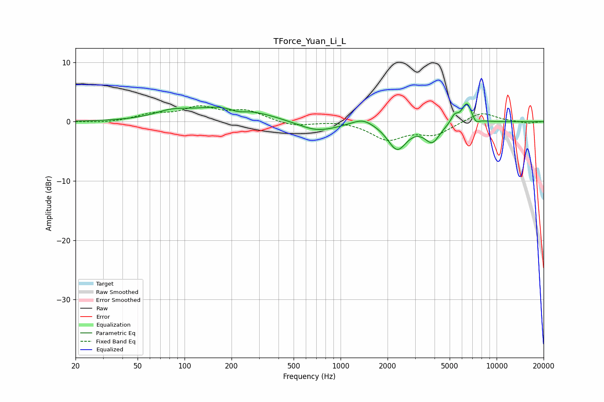

# TForce_Yuan_Li_L
See [usage instructions](https://github.com/jaakkopasanen/AutoEq#usage) for more options and info.

### Parametric EQs
Apply preamp of -3.1 dB when using parametric equalizer.

|   # | Type    |   Fc (Hz) |    Q |   Gain (dB) |
|-----|---------|-----------|------|-------------|
|   1 | Peaking |        82 | 1.3  |         1.1 |
|   2 | Peaking |       193 | 0.65 |         2.6 |
|   3 | Peaking |       219 | 2.42 |        -0.8 |
|   4 | Peaking |       708 | 1.11 |        -1.8 |
|   5 | Peaking |      1387 | 2.14 |         1.1 |
|   6 | Peaking |      2304 | 2.33 |        -4.5 |
|   7 | Peaking |      3870 | 2.88 |        -3.1 |
|   8 | Peaking |      5375 | 6    |         1.3 |
|   9 | Peaking |      6455 | 4.2  |         3.4 |
|  10 | Peaking |      7325 | 5.97 |        -1   |

### Fixed Band EQs
When using fixed band (also called graphic) equalizer, apply preamp of **-2.8 dB** (if available) and set gains manually with these parameters.

|   # | Type    |   Fc (Hz) |    Q |   Gain (dB) |
|-----|---------|-----------|------|-------------|
|   1 | Peaking |        31 | 1.41 |        -0.2 |
|   2 | Peaking |        62 | 1.41 |         1.1 |
|   3 | Peaking |       125 | 1.41 |         2.2 |
|   4 | Peaking |       250 | 1.41 |         1.7 |
|   5 | Peaking |       500 | 1.41 |        -0.8 |
|   6 | Peaking |      1000 | 1.41 |         0.2 |
|   7 | Peaking |      2000 | 1.41 |        -2.9 |
|   8 | Peaking |      4000 | 1.41 |        -2   |
|   9 | Peaking |      8000 | 1.41 |         1.7 |
|  10 | Peaking |     16000 | 1.41 |        -0.3 |

### Graphs

