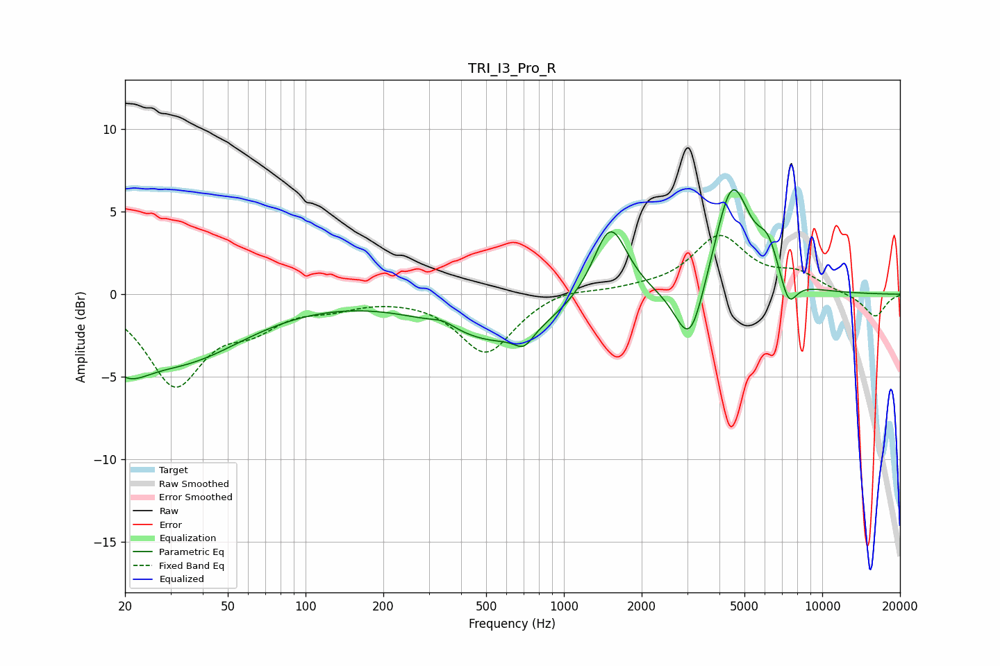

# TRI_I3_Pro_R
See [usage instructions](https://github.com/jaakkopasanen/AutoEq#usage) for more options and info.

### Parametric EQs
Apply preamp of -6.4 dB when using parametric equalizer.

|   # | Type    |   Fc (Hz) |    Q |   Gain (dB) |
|-----|---------|-----------|------|-------------|
|   1 | Peaking |        20 | 1.6  |        -2.3 |
|   2 | Peaking |        33 | 0.57 |        -3.7 |
|   3 | Peaking |       340 | 2.93 |         0.4 |
|   4 | Peaking |       553 | 0.65 |        -2.8 |
|   5 | Peaking |       701 | 4    |        -0.9 |
|   6 | Peaking |      1512 | 2.12 |         4.7 |
|   7 | Peaking |      3078 | 2.45 |        -4.2 |
|   8 | Peaking |      4475 | 2    |         6.9 |
|   9 | Peaking |      6168 | 3.28 |         2   |
|  10 | Peaking |      7403 | 4.17 |        -1.8 |

### Fixed Band EQs
When using fixed band (also called graphic) equalizer, apply preamp of **-3.7 dB** (if available) and set gains manually with these parameters.

|   # | Type    |   Fc (Hz) |    Q |   Gain (dB) |
|-----|---------|-----------|------|-------------|
|   1 | Peaking |        31 | 1.41 |        -5.3 |
|   2 | Peaking |        62 | 1.41 |        -1.6 |
|   3 | Peaking |       125 | 1.41 |        -0.6 |
|   4 | Peaking |       250 | 1.41 |        -0   |
|   5 | Peaking |       500 | 1.41 |        -3.6 |
|   6 | Peaking |      1000 | 1.41 |         0.4 |
|   7 | Peaking |      2000 | 1.41 |         0.2 |
|   8 | Peaking |      4000 | 1.41 |         3.4 |
|   9 | Peaking |      8000 | 1.41 |         1.1 |
|  10 | Peaking |     16000 | 1.41 |        -1.4 |

### Graphs

