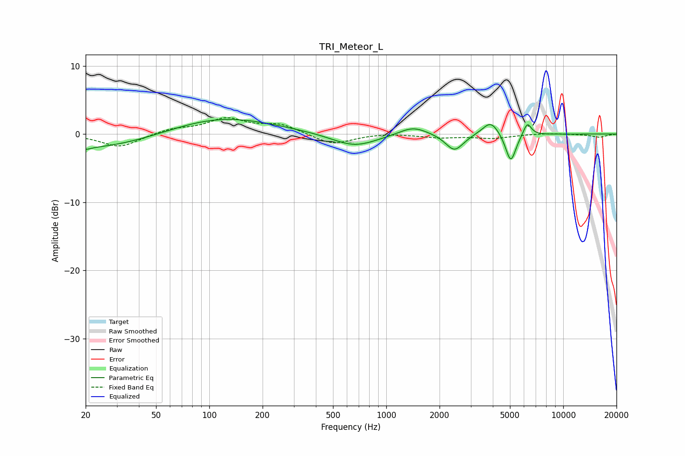

# TRI_Meteor_L
See [usage instructions](https://github.com/jaakkopasanen/AutoEq#usage) for more options and info.

### Parametric EQs
Apply preamp of -2.2 dB when using parametric equalizer.

|   # | Type    |   Fc (Hz) |    Q |   Gain (dB) |
|-----|---------|-----------|------|-------------|
|   1 | Peaking |        20 | 5.25 |        -0.3 |
|   2 | Peaking |        22 | 0.39 |        -2.3 |
|   3 | Peaking |       115 | 0.47 |         2.6 |
|   4 | Peaking |       661 | 1.11 |        -1.9 |
|   5 | Peaking |      1418 | 1.76 |         1.3 |
|   6 | Peaking |      2423 | 2.91 |        -2   |
|   7 | Peaking |      2468 | 2.44 |        -0.5 |
|   8 | Peaking |      3893 | 3.01 |         2.1 |
|   9 | Peaking |      5053 | 4.72 |        -4.3 |
|  10 | Peaking |      6264 | 6    |         1.9 |

### Fixed Band EQs
When using fixed band (also called graphic) equalizer, apply preamp of **-2.5 dB** (if available) and set gains manually with these parameters.

|   # | Type    |   Fc (Hz) |    Q |   Gain (dB) |
|-----|---------|-----------|------|-------------|
|   1 | Peaking |        31 | 1.41 |        -1.9 |
|   2 | Peaking |        62 | 1.41 |         0.7 |
|   3 | Peaking |       125 | 1.41 |         2.1 |
|   4 | Peaking |       250 | 1.41 |         1.3 |
|   5 | Peaking |       500 | 1.41 |        -1.6 |
|   6 | Peaking |      1000 | 1.41 |         0.2 |
|   7 | Peaking |      2000 | 1.41 |        -0.5 |
|   8 | Peaking |      4000 | 1.41 |        -0.6 |
|   9 | Peaking |      8000 | 1.41 |         0.1 |
|  10 | Peaking |     16000 | 1.41 |        -0.5 |

### Graphs

