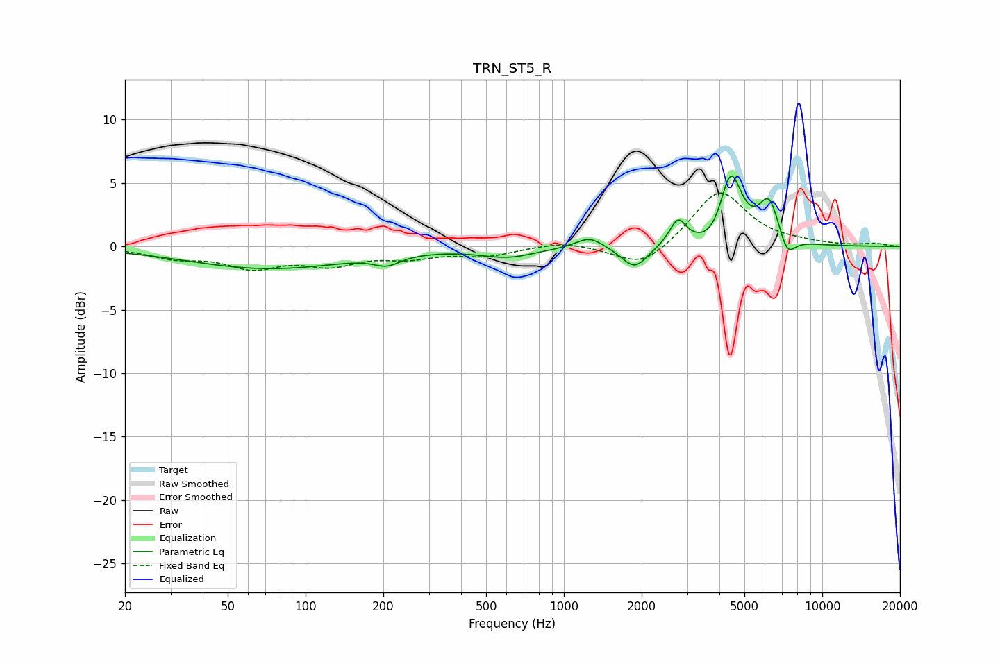

# TRN_ST5_R
See [usage instructions](https://github.com/jaakkopasanen/AutoEq#usage) for more options and info.

### Parametric EQs
Apply preamp of -5.7 dB when using parametric equalizer.

|   # | Type    |   Fc (Hz) |    Q |   Gain (dB) |
|-----|---------|-----------|------|-------------|
|   1 | Peaking |        72 | 0.46 |        -1.7 |
|   2 | Peaking |       207 | 2.81 |        -0.8 |
|   3 | Peaking |       606 | 1.34 |        -0.8 |
|   4 | Peaking |      1255 | 2.68 |         0.9 |
|   5 | Peaking |      1880 | 2.8  |        -1.8 |
|   6 | Peaking |      2764 | 4.37 |         2   |
|   7 | Peaking |      3930 | 2.45 |        -1.4 |
|   8 | Peaking |      4407 | 3.12 |         6.2 |
|   9 | Peaking |      6229 | 3.43 |         3.4 |
|  10 | Peaking |      7322 | 4.35 |        -1.7 |

### Fixed Band EQs
When using fixed band (also called graphic) equalizer, apply preamp of **-4.3 dB** (if available) and set gains manually with these parameters.

|   # | Type    |   Fc (Hz) |    Q |   Gain (dB) |
|-----|---------|-----------|------|-------------|
|   1 | Peaking |        31 | 1.41 |        -0.8 |
|   2 | Peaking |        62 | 1.41 |        -1.5 |
|   3 | Peaking |       125 | 1.41 |        -1.3 |
|   4 | Peaking |       250 | 1.41 |        -0.7 |
|   5 | Peaking |       500 | 1.41 |        -0.7 |
|   6 | Peaking |      1000 | 1.41 |         0.4 |
|   7 | Peaking |      2000 | 1.41 |        -1.8 |
|   8 | Peaking |      4000 | 1.41 |         4.5 |
|   9 | Peaking |      8000 | 1.41 |         0.2 |
|  10 | Peaking |     16000 | 1.41 |         0.2 |

### Graphs

