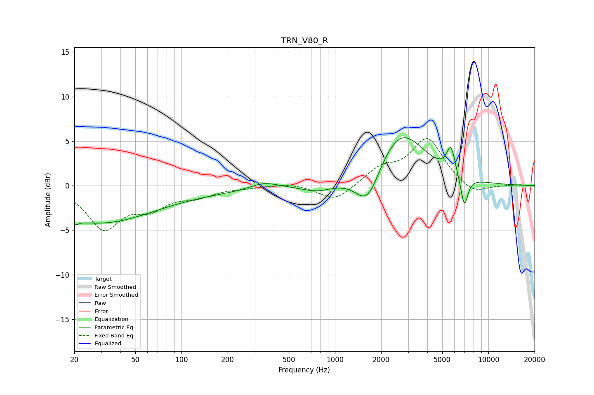

# TRN_V80_R
See [usage instructions](https://github.com/jaakkopasanen/AutoEq#usage) for more options and info.

### Parametric EQs
Apply preamp of -5.5 dB when using parametric equalizer.

|   # | Type    |   Fc (Hz) |    Q |   Gain (dB) |
|-----|---------|-----------|------|-------------|
|   1 | Peaking |        20 | 5.98 |        -3.7 |
|   2 | Peaking |        20 | 5.85 |         3.2 |
|   3 | Peaking |        28 | 0.4  |        -3.6 |
|   4 | Peaking |        74 | 0.18 |        -0.7 |
|   5 | Peaking |       345 | 1.49 |         0.8 |
|   6 | Peaking |       769 | 1.47 |        -0.8 |
|   7 | Peaking |      1632 | 1.77 |        -4.1 |
|   8 | Peaking |      2680 | 0.89 |         6.2 |
|   9 | Peaking |      5700 | 4.99 |         3   |
|  10 | Peaking |      6966 | 5.66 |        -3.5 |

### Fixed Band EQs
When using fixed band (also called graphic) equalizer, apply preamp of **-5.4 dB** (if available) and set gains manually with these parameters.

|   # | Type    |   Fc (Hz) |    Q |   Gain (dB) |
|-----|---------|-----------|------|-------------|
|   1 | Peaking |        31 | 1.41 |        -4.6 |
|   2 | Peaking |        62 | 1.41 |        -2.1 |
|   3 | Peaking |       125 | 1.41 |        -1   |
|   4 | Peaking |       250 | 1.41 |        -0.2 |
|   5 | Peaking |       500 | 1.41 |         0.3 |
|   6 | Peaking |      1000 | 1.41 |        -1.8 |
|   7 | Peaking |      2000 | 1.41 |         1.8 |
|   8 | Peaking |      4000 | 1.41 |         5.2 |
|   9 | Peaking |      8000 | 1.41 |        -1.1 |
|  10 | Peaking |     16000 | 1.41 |         0.1 |

### Graphs

