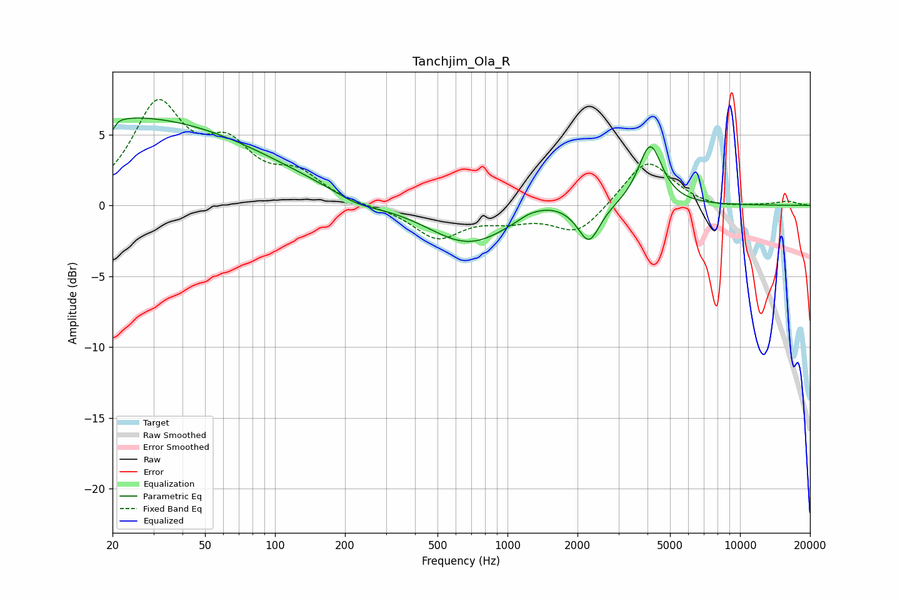

# Tanchjim_Ola_R
See [usage instructions](https://github.com/jaakkopasanen/AutoEq#usage) for more options and info.

### Parametric EQs
Apply preamp of -6.3 dB when using parametric equalizer.

|   # | Type    |   Fc (Hz) |    Q |   Gain (dB) |
|-----|---------|-----------|------|-------------|
|   1 | Peaking |        20 | 0.34 |         1.2 |
|   2 | Peaking |        20 | 6    |        -4.1 |
|   3 | Peaking |        20 | 5.91 |         3.3 |
|   4 | Peaking |        25 | 0.21 |         5.1 |
|   5 | Peaking |       224 | 1.44 |        -0.6 |
|   6 | Peaking |       679 | 0.82 |        -2.8 |
|   7 | Peaking |      1226 | 3.2  |         0.2 |
|   8 | Peaking |      1478 | 1.49 |         0.7 |
|   9 | Peaking |      2240 | 3.04 |        -2.6 |
|  10 | Peaking |      4108 | 2.75 |         4.3 |

### Fixed Band EQs
When using fixed band (also called graphic) equalizer, apply preamp of **-7.6 dB** (if available) and set gains manually with these parameters.

|   # | Type    |   Fc (Hz) |    Q |   Gain (dB) |
|-----|---------|-----------|------|-------------|
|   1 | Peaking |        31 | 1.41 |         6.8 |
|   2 | Peaking |        62 | 1.41 |         3.5 |
|   3 | Peaking |       125 | 1.41 |         1.9 |
|   4 | Peaking |       250 | 1.41 |        -0.1 |
|   5 | Peaking |       500 | 1.41 |        -2.3 |
|   6 | Peaking |      1000 | 1.41 |        -0.8 |
|   7 | Peaking |      2000 | 1.41 |        -2   |
|   8 | Peaking |      4000 | 1.41 |         3.3 |
|   9 | Peaking |      8000 | 1.41 |        -0.3 |
|  10 | Peaking |     16000 | 1.41 |         0.3 |

### Graphs

