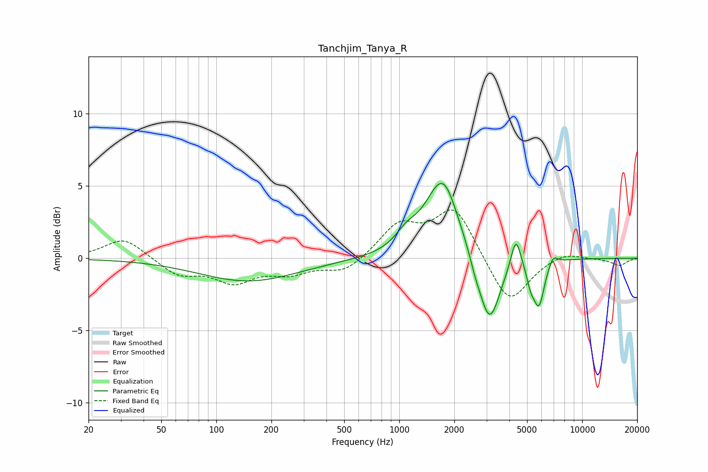

# Tanchjim_Tanya_R
See [usage instructions](https://github.com/jaakkopasanen/AutoEq#usage) for more options and info.

### Parametric EQs
Apply preamp of -5.3 dB when using parametric equalizer.

|   # | Type    |   Fc (Hz) |    Q |   Gain (dB) |
|-----|---------|-----------|------|-------------|
|   1 | Peaking |       150 | 0.52 |        -1.6 |
|   2 | Peaking |      1095 | 2.35 |         1   |
|   3 | Peaking |      1709 | 1.53 |         5.2 |
|   4 | Peaking |      1812 | 3.24 |         0.4 |
|   5 | Peaking |      2600 | 4.79 |        -0.6 |
|   6 | Peaking |      3112 | 2.43 |        -4.9 |
|   7 | Peaking |      4346 | 5.14 |         2.3 |
|   8 | Peaking |      5234 | 6    |        -1.1 |
|   9 | Peaking |      5809 | 4.54 |        -3   |
|  10 | Peaking |      6928 | 5.39 |         0.7 |

### Fixed Band EQs
When using fixed band (also called graphic) equalizer, apply preamp of **-3.4 dB** (if available) and set gains manually with these parameters.

|   # | Type    |   Fc (Hz) |    Q |   Gain (dB) |
|-----|---------|-----------|------|-------------|
|   1 | Peaking |        31 | 1.41 |         1.4 |
|   2 | Peaking |        62 | 1.41 |        -1.1 |
|   3 | Peaking |       125 | 1.41 |        -1.5 |
|   4 | Peaking |       250 | 1.41 |        -0.9 |
|   5 | Peaking |       500 | 1.41 |        -1   |
|   6 | Peaking |      1000 | 1.41 |         2.2 |
|   7 | Peaking |      2000 | 1.41 |         3.5 |
|   8 | Peaking |      4000 | 1.41 |        -3.3 |
|   9 | Peaking |      8000 | 1.41 |         0.5 |
|  10 | Peaking |     16000 | 1.41 |        -0.5 |

### Graphs

