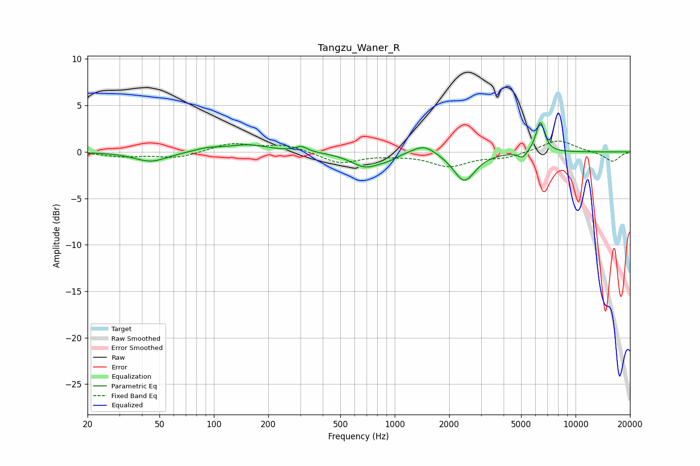

# Tangzu_Waner_R
See [usage instructions](https://github.com/jaakkopasanen/AutoEq#usage) for more options and info.

### Parametric EQs
Apply preamp of -3.3 dB when using parametric equalizer.

|   # | Type    |   Fc (Hz) |    Q |   Gain (dB) |
|-----|---------|-----------|------|-------------|
|   1 | Peaking |        45 | 1.56 |        -1.1 |
|   2 | Peaking |        93 | 1.94 |         0.4 |
|   3 | Peaking |       154 | 1.27 |         0.7 |
|   4 | Peaking |       305 | 4.4  |         0.6 |
|   5 | Peaking |       693 | 1.72 |        -1.6 |
|   6 | Peaking |       917 | 3.19 |        -0.4 |
|   7 | Peaking |      1449 | 2.2  |         1.1 |
|   8 | Peaking |      2426 | 2.37 |        -3.2 |
|   9 | Peaking |      5092 | 6    |        -0.7 |
|  10 | Peaking |      6384 | 5.75 |         3.3 |

### Fixed Band EQs
When using fixed band (also called graphic) equalizer, apply preamp of **-1.3 dB** (if available) and set gains manually with these parameters.

|   # | Type    |   Fc (Hz) |    Q |   Gain (dB) |
|-----|---------|-----------|------|-------------|
|   1 | Peaking |        31 | 1.41 |        -0.5 |
|   2 | Peaking |        62 | 1.41 |        -0.6 |
|   3 | Peaking |       125 | 1.41 |         0.9 |
|   4 | Peaking |       250 | 1.41 |         0.8 |
|   5 | Peaking |       500 | 1.41 |        -1.2 |
|   6 | Peaking |      1000 | 1.41 |        -0.2 |
|   7 | Peaking |      2000 | 1.41 |        -1.5 |
|   8 | Peaking |      4000 | 1.41 |        -0.6 |
|   9 | Peaking |      8000 | 1.41 |         1.3 |
|  10 | Peaking |     16000 | 1.41 |        -1.1 |

### Graphs

