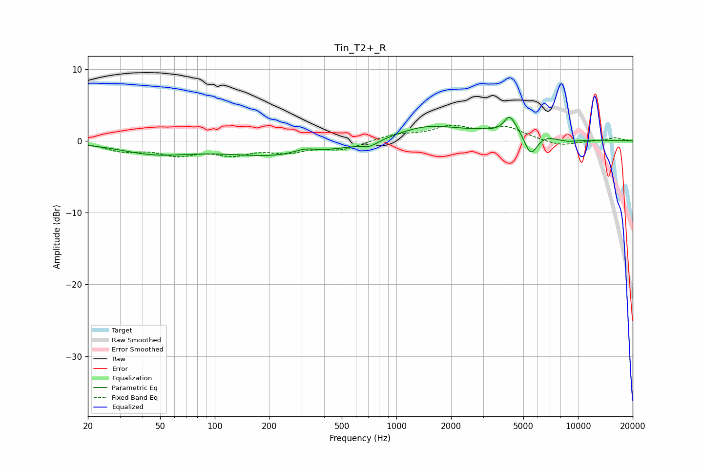

# Tin_T2+_R
See [usage instructions](https://github.com/jaakkopasanen/AutoEq#usage) for more options and info.

### Parametric EQs
Apply preamp of -3.4 dB when using parametric equalizer.

|   # | Type    |   Fc (Hz) |    Q |   Gain (dB) |
|-----|---------|-----------|------|-------------|
|   1 | Peaking |        47 | 0.72 |        -1.6 |
|   2 | Peaking |       237 | 0.44 |        -2.1 |
|   3 | Peaking |       313 | 2.15 |         0.7 |
|   4 | Peaking |       713 | 3.16 |        -0.7 |
|   5 | Peaking |      1464 | 0.81 |         2   |
|   6 | Peaking |      3633 | 1.97 |        -0.9 |
|   7 | Peaking |      4190 | 5.2  |         1.6 |
|   8 | Peaking |      4634 | 0.97 |         3.1 |
|   9 | Peaking |      5473 | 3.27 |        -4.2 |
|  10 | Peaking |      8480 | 1.58 |        -0.7 |

### Fixed Band EQs
When using fixed band (also called graphic) equalizer, apply preamp of **-2.3 dB** (if available) and set gains manually with these parameters.

|   # | Type    |   Fc (Hz) |    Q |   Gain (dB) |
|-----|---------|-----------|------|-------------|
|   1 | Peaking |        31 | 1.41 |        -1.2 |
|   2 | Peaking |        62 | 1.41 |        -1.7 |
|   3 | Peaking |       125 | 1.41 |        -1.6 |
|   4 | Peaking |       250 | 1.41 |        -1.3 |
|   5 | Peaking |       500 | 1.41 |        -1.1 |
|   6 | Peaking |      1000 | 1.41 |         0.8 |
|   7 | Peaking |      2000 | 1.41 |         1.8 |
|   8 | Peaking |      4000 | 1.41 |         1.8 |
|   9 | Peaking |      8000 | 1.41 |        -0.8 |
|  10 | Peaking |     16000 | 1.41 |         0.4 |

### Graphs

