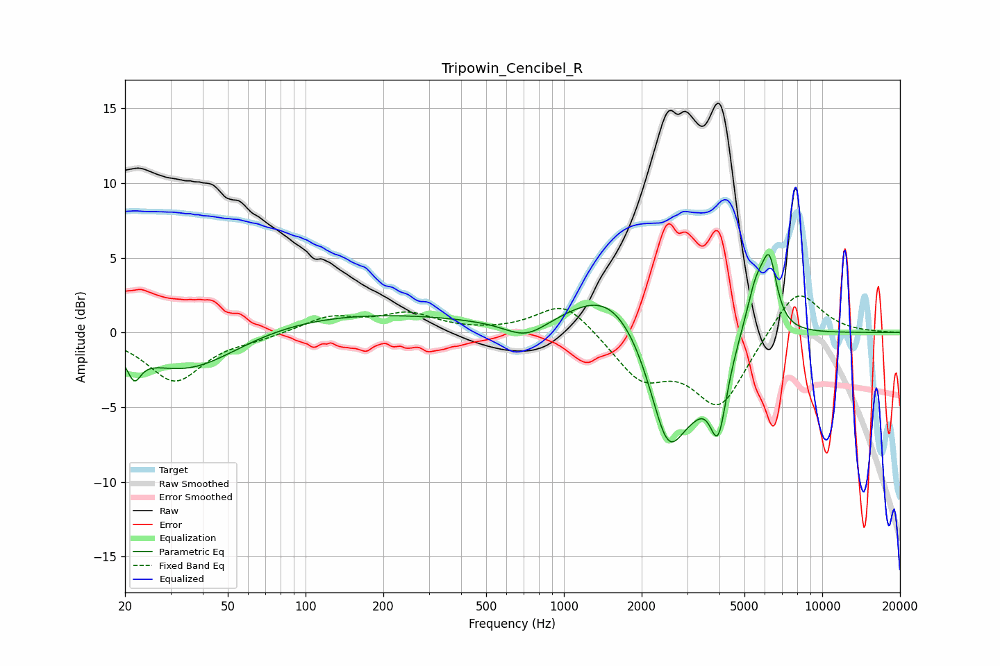

# Tripowin_Cencibel_R
See [usage instructions](https://github.com/jaakkopasanen/AutoEq#usage) for more options and info.

### Parametric EQs
Apply preamp of -5.3 dB when using parametric equalizer.

|   # | Type    |   Fc (Hz) |    Q |   Gain (dB) |
|-----|---------|-----------|------|-------------|
|   1 | Peaking |        22 | 5.67 |        -1.6 |
|   2 | Peaking |        35 | 0.67 |        -3.5 |
|   3 | Peaking |       101 | 0.21 |         1.5 |
|   4 | Peaking |       714 | 1.69 |        -1.2 |
|   5 | Peaking |      1523 | 0.91 |         3.2 |
|   6 | Peaking |      2530 | 1.86 |        -7.9 |
|   7 | Peaking |      3212 | 2.32 |        -1.7 |
|   8 | Peaking |      3958 | 4.13 |        -5.3 |
|   9 | Peaking |      5555 | 3.35 |         3.4 |
|  10 | Peaking |      6254 | 4.87 |         3.9 |

### Fixed Band EQs
When using fixed band (also called graphic) equalizer, apply preamp of **-2.5 dB** (if available) and set gains manually with these parameters.

|   # | Type    |   Fc (Hz) |    Q |   Gain (dB) |
|-----|---------|-----------|------|-------------|
|   1 | Peaking |        31 | 1.41 |        -3.2 |
|   2 | Peaking |        62 | 1.41 |        -0.3 |
|   3 | Peaking |       125 | 1.41 |         1   |
|   4 | Peaking |       250 | 1.41 |         1.2 |
|   5 | Peaking |       500 | 1.41 |        -0   |
|   6 | Peaking |      1000 | 1.41 |         2.2 |
|   7 | Peaking |      2000 | 1.41 |        -2.9 |
|   8 | Peaking |      4000 | 1.41 |        -4.8 |
|   9 | Peaking |      8000 | 1.41 |         3.2 |
|  10 | Peaking |     16000 | 1.41 |         0   |

### Graphs

