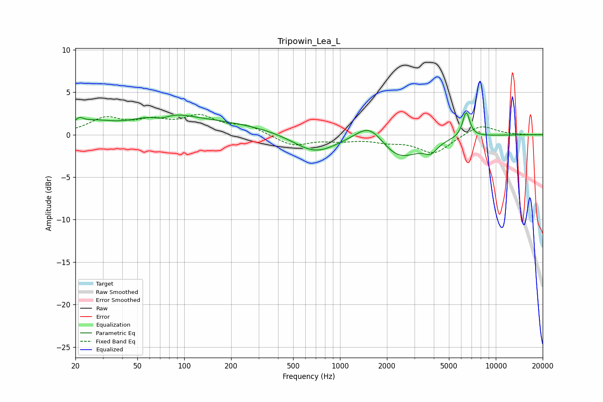

# Tripowin_Lea_L
See [usage instructions](https://github.com/jaakkopasanen/AutoEq#usage) for more options and info.

### Parametric EQs
Apply preamp of -2.7 dB when using parametric equalizer.

|   # | Type    |   Fc (Hz) |    Q |   Gain (dB) |
|-----|---------|-----------|------|-------------|
|   1 | Peaking |        21 | 6    |         0.6 |
|   2 | Peaking |        25 | 1.09 |         1.2 |
|   3 | Peaking |        71 | 2.2  |        -0.9 |
|   4 | Peaking |        72 | 0.93 |         1.9 |
|   5 | Peaking |       166 | 0.4  |         1.3 |
|   6 | Peaking |       690 | 1.01 |        -2.2 |
|   7 | Peaking |      1557 | 1.54 |         2.5 |
|   8 | Peaking |      2370 | 1.05 |        -3   |
|   9 | Peaking |      3824 | 3.36 |        -1.1 |
|  10 | Peaking |      6458 | 5.99 |         3   |

### Fixed Band EQs
When using fixed band (also called graphic) equalizer, apply preamp of **-2.5 dB** (if available) and set gains manually with these parameters.

|   # | Type    |   Fc (Hz) |    Q |   Gain (dB) |
|-----|---------|-----------|------|-------------|
|   1 | Peaking |        31 | 1.41 |         1.8 |
|   2 | Peaking |        62 | 1.41 |         1.3 |
|   3 | Peaking |       125 | 1.41 |         2   |
|   4 | Peaking |       250 | 1.41 |         1   |
|   5 | Peaking |       500 | 1.41 |        -1.3 |
|   6 | Peaking |      1000 | 1.41 |        -0.5 |
|   7 | Peaking |      2000 | 1.41 |        -0.6 |
|   8 | Peaking |      4000 | 1.41 |        -2.2 |
|   9 | Peaking |      8000 | 1.41 |         1.2 |
|  10 | Peaking |     16000 | 1.41 |        -0   |

### Graphs

