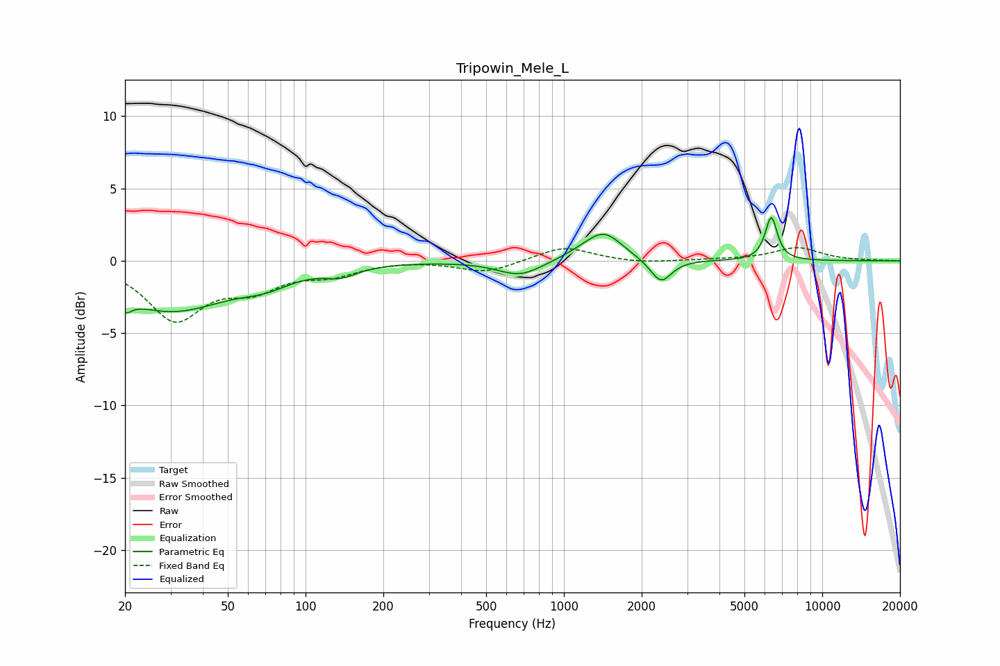

# Tripowin_Mele_L
See [usage instructions](https://github.com/jaakkopasanen/AutoEq#usage) for more options and info.

### Parametric EQs
Apply preamp of -3.1 dB when using parametric equalizer.

|   # | Type    |   Fc (Hz) |    Q |   Gain (dB) |
|-----|---------|-----------|------|-------------|
|   1 | Peaking |        20 | 6    |         2.5 |
|   2 | Peaking |        20 | 5.93 |        -3.4 |
|   3 | Peaking |        30 | 0.63 |        -3.4 |
|   4 | Peaking |        70 | 1.41 |        -0.8 |
|   5 | Peaking |       137 | 2.27 |        -0.6 |
|   6 | Peaking |       676 | 1.66 |        -1.1 |
|   7 | Peaking |      1210 | 1.66 |         0.4 |
|   8 | Peaking |      1437 | 2.04 |         1.8 |
|   9 | Peaking |      2374 | 3.43 |        -1.7 |
|  10 | Peaking |      6348 | 5.93 |         3   |

### Fixed Band EQs
When using fixed band (also called graphic) equalizer, apply preamp of **-1.0 dB** (if available) and set gains manually with these parameters.

|   # | Type    |   Fc (Hz) |    Q |   Gain (dB) |
|-----|---------|-----------|------|-------------|
|   1 | Peaking |        31 | 1.41 |        -3.9 |
|   2 | Peaking |        62 | 1.41 |        -1.6 |
|   3 | Peaking |       125 | 1.41 |        -0.8 |
|   4 | Peaking |       250 | 1.41 |         0.1 |
|   5 | Peaking |       500 | 1.41 |        -0.8 |
|   6 | Peaking |      1000 | 1.41 |         1   |
|   7 | Peaking |      2000 | 1.41 |        -0.2 |
|   8 | Peaking |      4000 | 1.41 |         0.1 |
|   9 | Peaking |      8000 | 1.41 |         0.9 |
|  10 | Peaking |     16000 | 1.41 |         0   |

### Graphs

