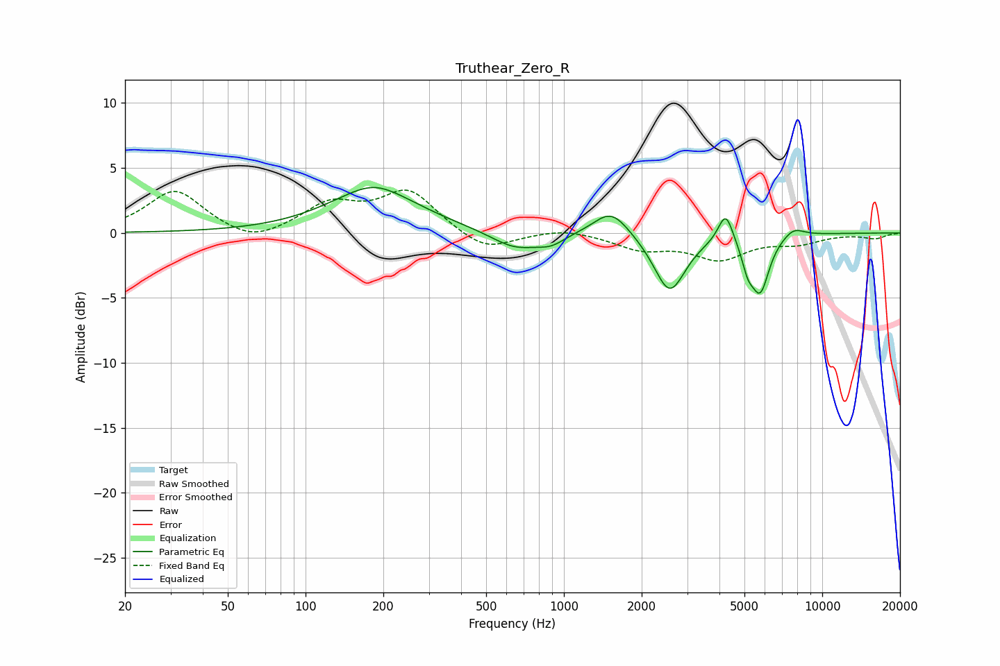

# Truthear_Zero_R
See [usage instructions](https://github.com/jaakkopasanen/AutoEq#usage) for more options and info.

### Parametric EQs
Apply preamp of -3.6 dB when using parametric equalizer.

|   # | Type    |   Fc (Hz) |    Q |   Gain (dB) |
|-----|---------|-----------|------|-------------|
|   1 | Peaking |       184 | 0.8  |         3.2 |
|   2 | Peaking |       184 | 1.96 |         0.3 |
|   3 | Peaking |       649 | 1.47 |        -1.4 |
|   4 | Peaking |       892 | 2.65 |        -0.7 |
|   5 | Peaking |      1525 | 2.07 |         2   |
|   6 | Peaking |      2567 | 2.32 |        -4.5 |
|   7 | Peaking |      4228 | 4.89 |         2.4 |
|   8 | Peaking |      5147 | 6    |        -1.6 |
|   9 | Peaking |      5753 | 3.91 |        -4.2 |
|  10 | Peaking |      7748 | 3.27 |         0.7 |

### Fixed Band EQs
When using fixed band (also called graphic) equalizer, apply preamp of **-3.4 dB** (if available) and set gains manually with these parameters.

|   # | Type    |   Fc (Hz) |    Q |   Gain (dB) |
|-----|---------|-----------|------|-------------|
|   1 | Peaking |        31 | 1.41 |         3.3 |
|   2 | Peaking |        62 | 1.41 |        -1   |
|   3 | Peaking |       125 | 1.41 |         2.1 |
|   4 | Peaking |       250 | 1.41 |         3.2 |
|   5 | Peaking |       500 | 1.41 |        -1.5 |
|   6 | Peaking |      1000 | 1.41 |         0.4 |
|   7 | Peaking |      2000 | 1.41 |        -1.1 |
|   8 | Peaking |      4000 | 1.41 |        -1.9 |
|   9 | Peaking |      8000 | 1.41 |        -0.7 |
|  10 | Peaking |     16000 | 1.41 |        -0.4 |

### Graphs

