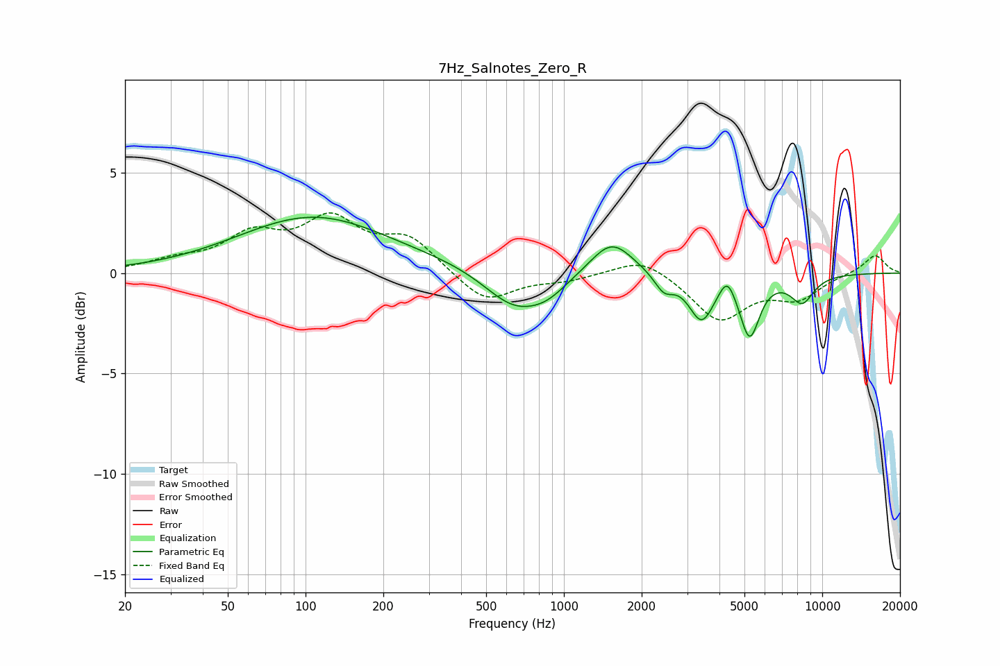

# 7Hz_Salnotes_Zero_R
See [usage instructions](https://github.com/jaakkopasanen/AutoEq#usage) for more options and info.

### Parametric EQs
Apply preamp of -2.9 dB when using parametric equalizer.

|   # | Type    |   Fc (Hz) |    Q |   Gain (dB) |
|-----|---------|-----------|------|-------------|
|   1 | Peaking |       108 | 0.49 |         2.8 |
|   2 | Peaking |       378 | 0.81 |         0.2 |
|   3 | Peaking |       647 | 1.18 |        -1.9 |
|   4 | Peaking |       865 | 1.85 |        -0.6 |
|   5 | Peaking |      1530 | 1.71 |         1.8 |
|   6 | Peaking |      2440 | 3.8  |        -0.9 |
|   7 | Peaking |      3411 | 2.88 |        -2.2 |
|   8 | Peaking |      4286 | 4.69 |         1   |
|   9 | Peaking |      5235 | 3.65 |        -3   |
|  10 | Peaking |      8363 | 2.84 |        -1.3 |

### Fixed Band EQs
When using fixed band (also called graphic) equalizer, apply preamp of **-3.1 dB** (if available) and set gains manually with these parameters.

|   # | Type    |   Fc (Hz) |    Q |   Gain (dB) |
|-----|---------|-----------|------|-------------|
|   1 | Peaking |        31 | 1.41 |         0.5 |
|   2 | Peaking |        62 | 1.41 |         1.7 |
|   3 | Peaking |       125 | 1.41 |         2.4 |
|   4 | Peaking |       250 | 1.41 |         1.6 |
|   5 | Peaking |       500 | 1.41 |        -1.5 |
|   6 | Peaking |      1000 | 1.41 |        -0.3 |
|   7 | Peaking |      2000 | 1.41 |         0.9 |
|   8 | Peaking |      4000 | 1.41 |        -2.3 |
|   9 | Peaking |      8000 | 1.41 |        -1.2 |
|  10 | Peaking |     16000 | 1.41 |         0.9 |

### Graphs

