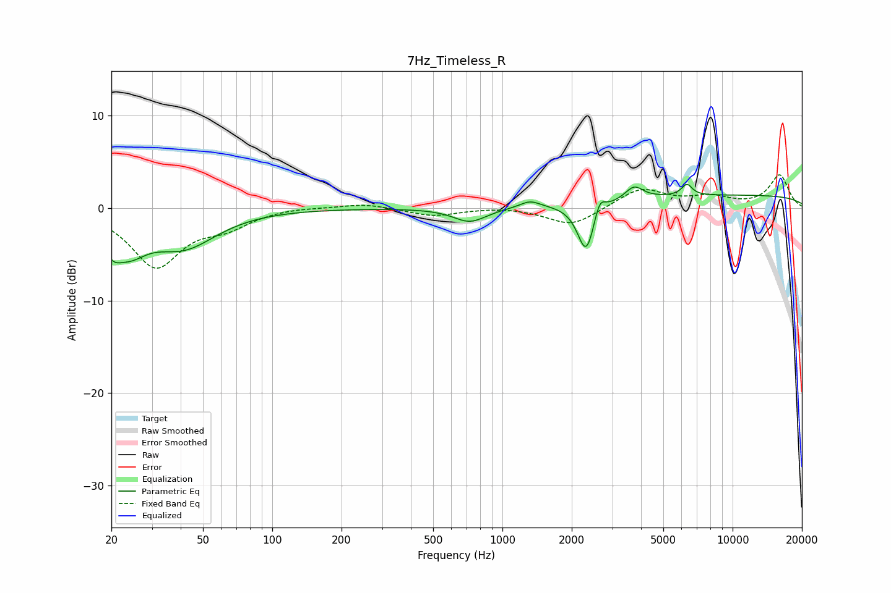

# 7Hz_Timeless_R
See [usage instructions](https://github.com/jaakkopasanen/AutoEq#usage) for more options and info.

### Parametric EQs
Apply preamp of -2.7 dB when using parametric equalizer.

|   # | Type    |   Fc (Hz) |    Q |   Gain (dB) |
|-----|---------|-----------|------|-------------|
|   1 | Peaking |        20 | 3.72 |        -2.1 |
|   2 | Peaking |        24 | 1.84 |        -3.2 |
|   3 | Peaking |        41 | 0.98 |        -3.9 |
|   4 | Peaking |       722 | 1.96 |        -1.5 |
|   5 | Peaking |      1318 | 3.27 |         0.7 |
|   6 | Peaking |      2314 | 3.78 |        -5.5 |
|   7 | Peaking |      2641 | 6    |         2   |
|   8 | Peaking |      3734 | 3.65 |         1.4 |
|   9 | Peaking |      6331 | 6    |         1.2 |
|  10 | Peaking |     10000 | 0.18 |         1.4 |

### Fixed Band EQs
When using fixed band (also called graphic) equalizer, apply preamp of **-3.7 dB** (if available) and set gains manually with these parameters.

|   # | Type    |   Fc (Hz) |    Q |   Gain (dB) |
|-----|---------|-----------|------|-------------|
|   1 | Peaking |        31 | 1.41 |        -6.2 |
|   2 | Peaking |        62 | 1.41 |        -1.7 |
|   3 | Peaking |       125 | 1.41 |         0.2 |
|   4 | Peaking |       250 | 1.41 |         0.5 |
|   5 | Peaking |       500 | 1.41 |        -0.8 |
|   6 | Peaking |      1000 | 1.41 |         0.2 |
|   7 | Peaking |      2000 | 1.41 |        -2   |
|   8 | Peaking |      4000 | 1.41 |         2.1 |
|   9 | Peaking |      8000 | 1.41 |         1.1 |
|  10 | Peaking |     16000 | 1.41 |         3.5 |

### Graphs

