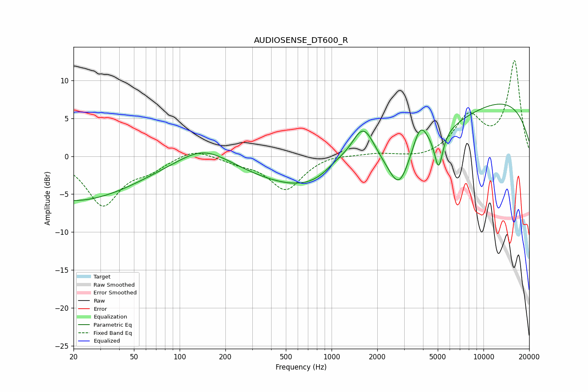

# AUDIOSENSE_DT600_R
See [usage instructions](https://github.com/jaakkopasanen/AutoEq#usage) for more options and info.

### Parametric EQs
Apply preamp of -7.0 dB when using parametric equalizer.

|   # | Type    |   Fc (Hz) |    Q |   Gain (dB) |
|-----|---------|-----------|------|-------------|
|   1 | Peaking |        20 | 0.33 |        -5.9 |
|   2 | Peaking |       143 | 0.87 |         2.4 |
|   3 | Peaking |      1075 | 1.53 |         1.8 |
|   4 | Peaking |      1611 | 0.2  |        -6   |
|   5 | Peaking |      1614 | 1.63 |         6.8 |
|   6 | Peaking |      2782 | 2.16 |        -4.4 |
|   7 | Peaking |      3835 | 2.95 |         3.5 |
|   8 | Peaking |      5068 | 5.15 |        -4.7 |
|   9 | Peaking |      9342 | 0.25 |         4.4 |
|  10 | Peaking |     10000 | 0.2  |         4   |

### Fixed Band EQs
When using fixed band (also called graphic) equalizer, apply preamp of **-12.7 dB** (if available) and set gains manually with these parameters.

|   # | Type    |   Fc (Hz) |    Q |   Gain (dB) |
|-----|---------|-----------|------|-------------|
|   1 | Peaking |        31 | 1.41 |        -6.3 |
|   2 | Peaking |        62 | 1.41 |        -1.4 |
|   3 | Peaking |       125 | 1.41 |         1.2 |
|   4 | Peaking |       250 | 1.41 |        -0.7 |
|   5 | Peaking |       500 | 1.41 |        -4.4 |
|   6 | Peaking |      1000 | 1.41 |         0.4 |
|   7 | Peaking |      2000 | 1.41 |         0.4 |
|   8 | Peaking |      4000 | 1.41 |        -0.4 |
|   9 | Peaking |      8000 | 1.41 |         5   |
|  10 | Peaking |     16000 | 1.41 |        12.5 |

### Graphs

