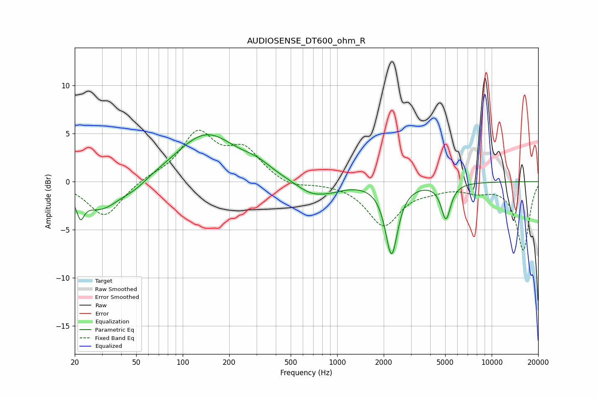

# AUDIOSENSE_DT600_ohm_R
See [usage instructions](https://github.com/jaakkopasanen/AutoEq#usage) for more options and info.

### Parametric EQs
Apply preamp of -5.0 dB when using parametric equalizer.

|   # | Type    |   Fc (Hz) |    Q |   Gain (dB) |
|-----|---------|-----------|------|-------------|
|   1 | Peaking |        22 | 5.95 |        -3.9 |
|   2 | Peaking |        22 | 6    |         1.8 |
|   3 | Peaking |        29 | 1.07 |        -3   |
|   4 | Peaking |        49 | 1.77 |        -0.7 |
|   5 | Peaking |       142 | 0.73 |         5   |
|   6 | Peaking |       303 | 1.52 |         0.8 |
|   7 | Peaking |       693 | 1.27 |        -1.5 |
|   8 | Peaking |       954 | 1.77 |        -0.3 |
|   9 | Peaking |      2248 | 3.57 |        -7.4 |
|  10 | Peaking |      5056 | 4.61 |        -3.7 |

### Fixed Band EQs
When using fixed band (also called graphic) equalizer, apply preamp of **-5.4 dB** (if available) and set gains manually with these parameters.

|   # | Type    |   Fc (Hz) |    Q |   Gain (dB) |
|-----|---------|-----------|------|-------------|
|   1 | Peaking |        31 | 1.41 |        -3.7 |
|   2 | Peaking |        62 | 1.41 |         0.4 |
|   3 | Peaking |       125 | 1.41 |         4.9 |
|   4 | Peaking |       250 | 1.41 |         3.1 |
|   5 | Peaking |       500 | 1.41 |        -0.7 |
|   6 | Peaking |      1000 | 1.41 |        -0.1 |
|   7 | Peaking |      2000 | 1.41 |        -4.5 |
|   8 | Peaking |      4000 | 1.41 |        -0.5 |
|   9 | Peaking |      8000 | 1.41 |        -0.8 |
|  10 | Peaking |     16000 | 1.41 |        -7.1 |

### Graphs

