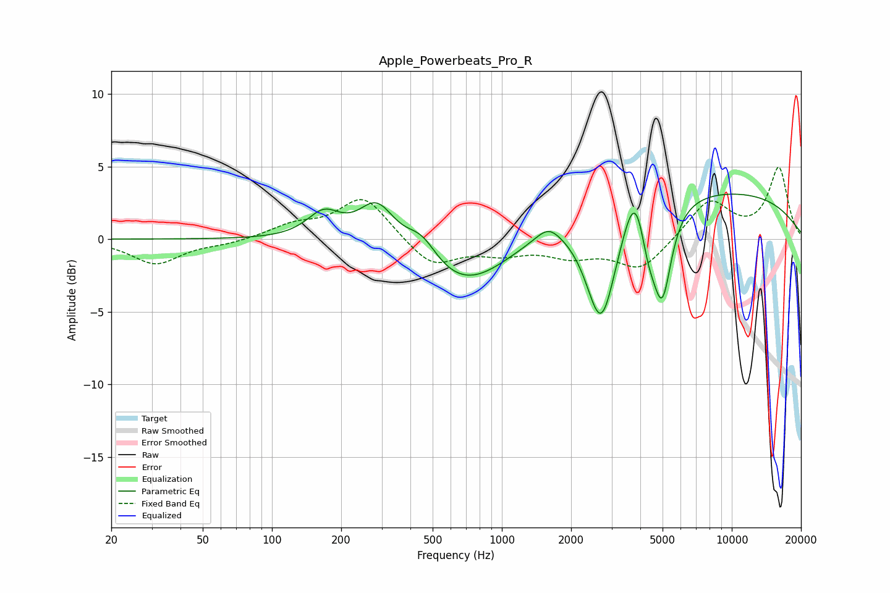

# Apple_Powerbeats_Pro_R
See [usage instructions](https://github.com/jaakkopasanen/AutoEq#usage) for more options and info.

### Parametric EQs
Apply preamp of -3.2 dB when using parametric equalizer.

|   # | Type    |   Fc (Hz) |    Q |   Gain (dB) |
|-----|---------|-----------|------|-------------|
|   1 | Peaking |       168 | 1.94 |         1.8 |
|   2 | Peaking |       286 | 1.78 |         3   |
|   3 | Peaking |       448 | 1.98 |         1.8 |
|   4 | Peaking |       688 | 0.67 |        -3.9 |
|   5 | Peaking |      1593 | 2.71 |         0.9 |
|   6 | Peaking |      2705 | 2.08 |        -8   |
|   7 | Peaking |      3829 | 2.82 |         4.1 |
|   8 | Peaking |      4318 | 3.48 |        -3.1 |
|   9 | Peaking |      4989 | 3.44 |        -6.2 |
|  10 | Peaking |      6284 | 0.18 |         3.6 |

### Fixed Band EQs
When using fixed band (also called graphic) equalizer, apply preamp of **-5.0 dB** (if available) and set gains manually with these parameters.

|   # | Type    |   Fc (Hz) |    Q |   Gain (dB) |
|-----|---------|-----------|------|-------------|
|   1 | Peaking |        31 | 1.41 |        -1.7 |
|   2 | Peaking |        62 | 1.41 |        -0.3 |
|   3 | Peaking |       125 | 1.41 |         0.9 |
|   4 | Peaking |       250 | 1.41 |         3   |
|   5 | Peaking |       500 | 1.41 |        -1.9 |
|   6 | Peaking |      1000 | 1.41 |        -0.8 |
|   7 | Peaking |      2000 | 1.41 |        -1   |
|   8 | Peaking |      4000 | 1.41 |        -2.1 |
|   9 | Peaking |      8000 | 1.41 |         2.7 |
|  10 | Peaking |     16000 | 1.41 |         4.9 |

### Graphs

