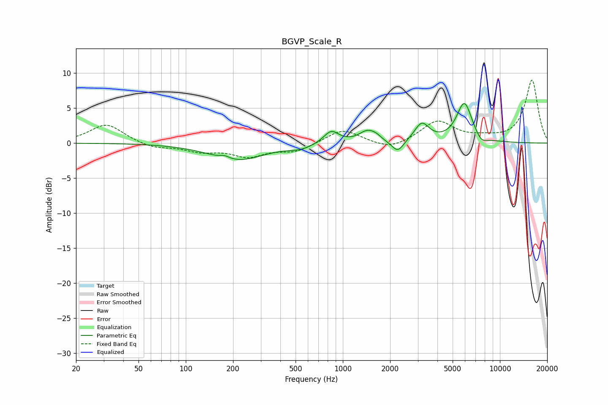

# BGVP_Scale_R
See [usage instructions](https://github.com/jaakkopasanen/AutoEq#usage) for more options and info.

### Parametric EQs
Apply preamp of -5.7 dB when using parametric equalizer.

|   # | Type    |   Fc (Hz) |    Q |   Gain (dB) |
|-----|---------|-----------|------|-------------|
|   1 | Peaking |       177 | 4.68 |         0.4 |
|   2 | Peaking |       212 | 0.82 |        -2.4 |
|   3 | Peaking |       538 | 1.92 |        -0.6 |
|   4 | Peaking |       843 | 2.95 |         1.8 |
|   5 | Peaking |      1438 | 2.62 |         1.6 |
|   6 | Peaking |      1631 | 4.61 |         0.4 |
|   7 | Peaking |      2236 | 3.68 |        -1.7 |
|   8 | Peaking |      3182 | 3.04 |         2.6 |
|   9 | Peaking |      5939 | 2.77 |         5.7 |
|  10 | Peaking |      7603 | 3.74 |        -1   |

### Fixed Band EQs
When using fixed band (also called graphic) equalizer, apply preamp of **-9.1 dB** (if available) and set gains manually with these parameters.

|   # | Type    |   Fc (Hz) |    Q |   Gain (dB) |
|-----|---------|-----------|------|-------------|
|   1 | Peaking |        31 | 1.41 |         2.7 |
|   2 | Peaking |        62 | 1.41 |        -0.8 |
|   3 | Peaking |       125 | 1.41 |        -1   |
|   4 | Peaking |       250 | 1.41 |        -1.8 |
|   5 | Peaking |       500 | 1.41 |        -1.2 |
|   6 | Peaking |      1000 | 1.41 |         2   |
|   7 | Peaking |      2000 | 1.41 |        -1.1 |
|   8 | Peaking |      4000 | 1.41 |         3.1 |
|   9 | Peaking |      8000 | 1.41 |         0.5 |
|  10 | Peaking |     16000 | 1.41 |         9   |

### Graphs

