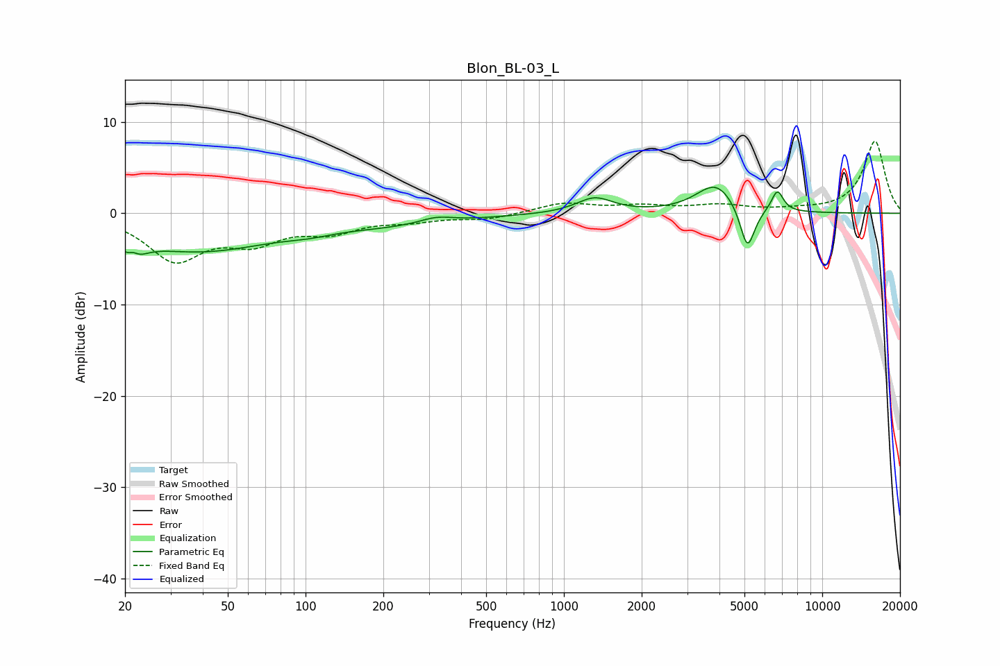

# Blon_BL-03_L
See [usage instructions](https://github.com/jaakkopasanen/AutoEq#usage) for more options and info.

### Parametric EQs
Apply preamp of -2.9 dB when using parametric equalizer.

|   # | Type    |   Fc (Hz) |    Q |   Gain (dB) |
|-----|---------|-----------|------|-------------|
|   1 | Peaking |        21 | 3.97 |        -4.3 |
|   2 | Peaking |        21 | 5.34 |         3   |
|   3 | Peaking |        38 | 0.48 |        -4   |
|   4 | Peaking |       103 | 1.53 |        -0.4 |
|   5 | Peaking |       223 | 0.54 |        -1.1 |
|   6 | Peaking |       320 | 2.11 |         0.7 |
|   7 | Peaking |      1315 | 2.02 |         1.7 |
|   8 | Peaking |      3879 | 1.84 |         3.2 |
|   9 | Peaking |      5132 | 4.84 |        -4.9 |
|  10 | Peaking |      6703 | 5.93 |         2.4 |

### Fixed Band EQs
When using fixed band (also called graphic) equalizer, apply preamp of **-8.0 dB** (if available) and set gains manually with these parameters.

|   # | Type    |   Fc (Hz) |    Q |   Gain (dB) |
|-----|---------|-----------|------|-------------|
|   1 | Peaking |        31 | 1.41 |        -4.9 |
|   2 | Peaking |        62 | 1.41 |        -2.7 |
|   3 | Peaking |       125 | 1.41 |        -1.7 |
|   4 | Peaking |       250 | 1.41 |        -0.7 |
|   5 | Peaking |       500 | 1.41 |        -0.6 |
|   6 | Peaking |      1000 | 1.41 |         1.1 |
|   7 | Peaking |      2000 | 1.41 |         0.7 |
|   8 | Peaking |      4000 | 1.41 |         0.8 |
|   9 | Peaking |      8000 | 1.41 |         0.2 |
|  10 | Peaking |     16000 | 1.41 |         7.9 |

### Graphs

