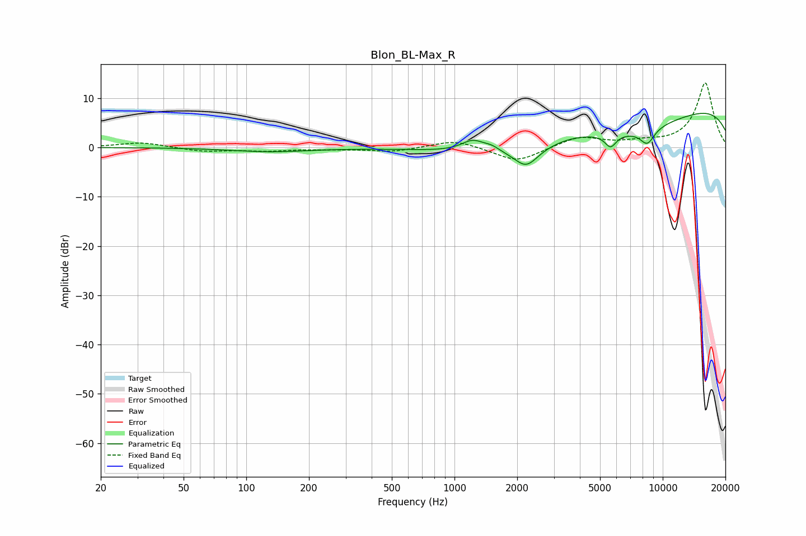

# Blon_BL-Max_R
See [usage instructions](https://github.com/jaakkopasanen/AutoEq#usage) for more options and info.

### Parametric EQs
Apply preamp of -7.0 dB when using parametric equalizer.

|   # | Type    |   Fc (Hz) |    Q |   Gain (dB) |
|-----|---------|-----------|------|-------------|
|   1 | Peaking |       130 | 0.75 |        -0.8 |
|   2 | Peaking |      1185 | 2.45 |        -1.1 |
|   3 | Peaking |      1213 | 2.48 |         3.5 |
|   4 | Peaking |      1510 | 3.78 |         0.8 |
|   5 | Peaking |      2212 | 2.48 |        -3.8 |
|   6 | Peaking |      3812 | 0.81 |         2.7 |
|   7 | Peaking |      4581 | 0.3  |        -8.4 |
|   8 | Peaking |      5615 | 5.17 |        -2.6 |
|   9 | Peaking |      8432 | 3.66 |        -3.2 |
|  10 | Peaking |     10000 | 0.18 |        10.4 |

### Fixed Band EQs
When using fixed band (also called graphic) equalizer, apply preamp of **-13.2 dB** (if available) and set gains manually with these parameters.

|   # | Type    |   Fc (Hz) |    Q |   Gain (dB) |
|-----|---------|-----------|------|-------------|
|   1 | Peaking |        31 | 1.41 |         1   |
|   2 | Peaking |        62 | 1.41 |        -0.8 |
|   3 | Peaking |       125 | 1.41 |        -0.6 |
|   4 | Peaking |       250 | 1.41 |        -0.3 |
|   5 | Peaking |       500 | 1.41 |        -0.9 |
|   6 | Peaking |      1000 | 1.41 |         1.6 |
|   7 | Peaking |      2000 | 1.41 |        -3   |
|   8 | Peaking |      4000 | 1.41 |         2.2 |
|   9 | Peaking |      8000 | 1.41 |         0.8 |
|  10 | Peaking |     16000 | 1.41 |        13.1 |

### Graphs

