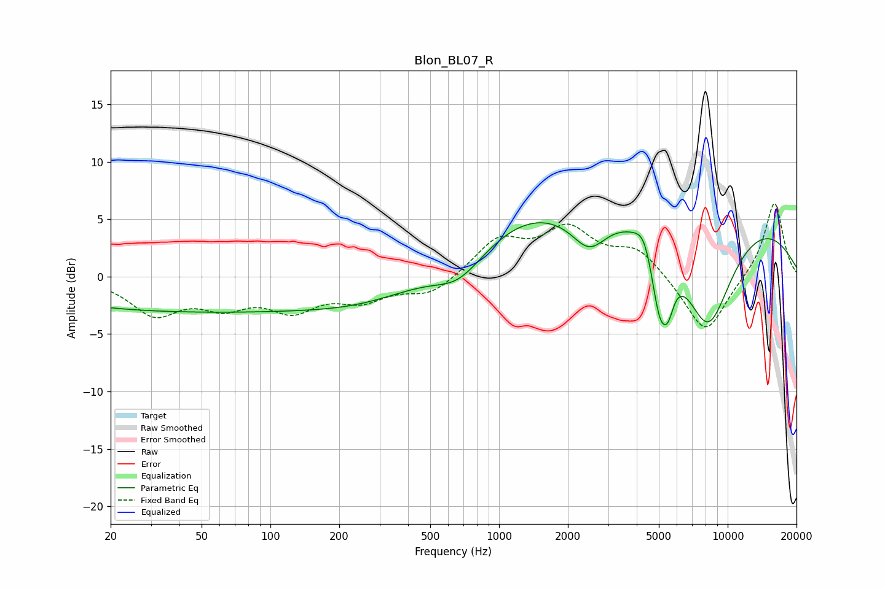

# Blon_BL07_R
See [usage instructions](https://github.com/jaakkopasanen/AutoEq#usage) for more options and info.

### Parametric EQs
Apply preamp of -4.8 dB when using parametric equalizer.

|   # | Type    |   Fc (Hz) |    Q |   Gain (dB) |
|-----|---------|-----------|------|-------------|
|   1 | Peaking |        45 | 0.18 |        -3   |
|   2 | Peaking |       259 | 0.62 |        -1   |
|   3 | Peaking |       664 | 1.4  |        -1.9 |
|   4 | Peaking |      1233 | 0.77 |         1.8 |
|   5 | Peaking |      2478 | 1.78 |        -3.2 |
|   6 | Peaking |      4311 | 3.79 |         1.6 |
|   7 | Peaking |      5043 | 3.59 |        -5.9 |
|   8 | Peaking |      5495 | 5.27 |        -2.4 |
|   9 | Peaking |      6192 | 0.19 |         7.5 |
|  10 | Peaking |      8190 | 1.08 |       -10.8 |

### Fixed Band EQs
When using fixed band (also called graphic) equalizer, apply preamp of **-6.5 dB** (if available) and set gains manually with these parameters.

|   # | Type    |   Fc (Hz) |    Q |   Gain (dB) |
|-----|---------|-----------|------|-------------|
|   1 | Peaking |        31 | 1.41 |        -3.1 |
|   2 | Peaking |        62 | 1.41 |        -2.1 |
|   3 | Peaking |       125 | 1.41 |        -2.5 |
|   4 | Peaking |       250 | 1.41 |        -1.8 |
|   5 | Peaking |       500 | 1.41 |        -1.6 |
|   6 | Peaking |      1000 | 1.41 |         3.1 |
|   7 | Peaking |      2000 | 1.41 |         3.8 |
|   8 | Peaking |      4000 | 1.41 |         2.3 |
|   9 | Peaking |      8000 | 1.41 |        -5.2 |
|  10 | Peaking |     16000 | 1.41 |         6.6 |

### Graphs

