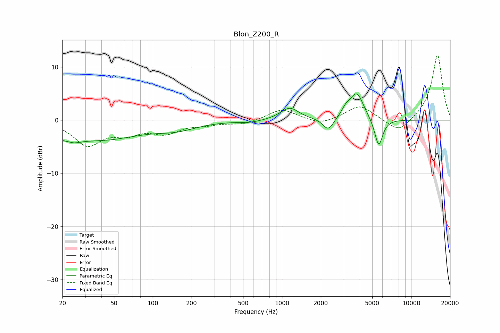

# Blon_Z200_R
See [usage instructions](https://github.com/jaakkopasanen/AutoEq#usage) for more options and info.

### Parametric EQs
Apply preamp of -5.1 dB when using parametric equalizer.

|   # | Type    |   Fc (Hz) |    Q |   Gain (dB) |
|-----|---------|-----------|------|-------------|
|   1 | Peaking |        22 | 2.34 |        -4.2 |
|   2 | Peaking |        22 | 3.07 |         2.8 |
|   3 | Peaking |        40 | 0.47 |        -3.5 |
|   4 | Peaking |       153 | 0.9  |        -1.3 |
|   5 | Peaking |       568 | 1.67 |        -0.4 |
|   6 | Peaking |      1147 | 2    |         2.3 |
|   7 | Peaking |      2286 | 3.43 |        -2.4 |
|   8 | Peaking |      3128 | 4.21 |         1.3 |
|   9 | Peaking |      3797 | 2.67 |         5.1 |
|  10 | Peaking |      5607 | 4.41 |        -5.3 |

### Fixed Band EQs
When using fixed band (also called graphic) equalizer, apply preamp of **-12.3 dB** (if available) and set gains manually with these parameters.

|   # | Type    |   Fc (Hz) |    Q |   Gain (dB) |
|-----|---------|-----------|------|-------------|
|   1 | Peaking |        31 | 1.41 |        -4.5 |
|   2 | Peaking |        62 | 1.41 |        -2.1 |
|   3 | Peaking |       125 | 1.41 |        -2.2 |
|   4 | Peaking |       250 | 1.41 |        -0.7 |
|   5 | Peaking |       500 | 1.41 |        -0.8 |
|   6 | Peaking |      1000 | 1.41 |         2.1 |
|   7 | Peaking |      2000 | 1.41 |        -1   |
|   8 | Peaking |      4000 | 1.41 |         2.8 |
|   9 | Peaking |      8000 | 1.41 |        -2.6 |
|  10 | Peaking |     16000 | 1.41 |        12.4 |

### Graphs

