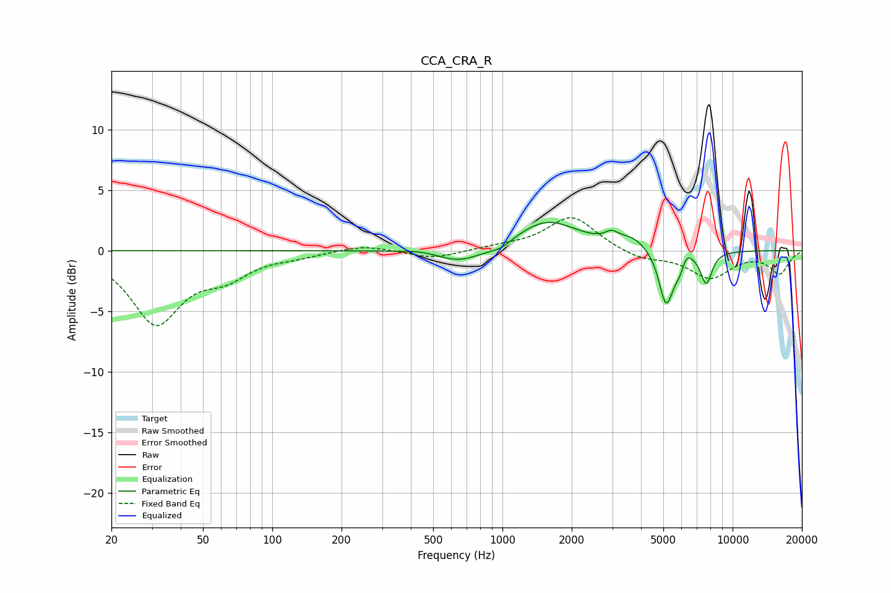

# CCA_CRA_R
See [usage instructions](https://github.com/jaakkopasanen/AutoEq#usage) for more options and info.

### Parametric EQs
Apply preamp of -2.4 dB when using parametric equalizer.

|   # | Type    |   Fc (Hz) |    Q |   Gain (dB) |
|-----|---------|-----------|------|-------------|
|   1 | Peaking |       467 | 1.47 |         0.4 |
|   2 | Peaking |       644 | 1.18 |        -1.3 |
|   3 | Peaking |       986 | 3.21 |        -0.4 |
|   4 | Peaking |      1555 | 1.05 |         2.5 |
|   5 | Peaking |      2977 | 5.16 |         0.6 |
|   6 | Peaking |      3662 | 2.04 |         0.9 |
|   7 | Peaking |      5145 | 4.42 |        -4.6 |
|   8 | Peaking |      5889 | 6    |        -1.1 |
|   9 | Peaking |      6289 | 6    |         0.9 |
|  10 | Peaking |      7687 | 5.39 |        -2.6 |

### Fixed Band EQs
When using fixed band (also called graphic) equalizer, apply preamp of **-2.8 dB** (if available) and set gains manually with these parameters.

|   # | Type    |   Fc (Hz) |    Q |   Gain (dB) |
|-----|---------|-----------|------|-------------|
|   1 | Peaking |        31 | 1.41 |        -5.9 |
|   2 | Peaking |        62 | 1.41 |        -1.8 |
|   3 | Peaking |       125 | 1.41 |        -0.4 |
|   4 | Peaking |       250 | 1.41 |         0.5 |
|   5 | Peaking |       500 | 1.41 |        -0.7 |
|   6 | Peaking |      1000 | 1.41 |         0.3 |
|   7 | Peaking |      2000 | 1.41 |         2.9 |
|   8 | Peaking |      4000 | 1.41 |        -0.7 |
|   9 | Peaking |      8000 | 1.41 |        -2.2 |
|  10 | Peaking |     16000 | 1.41 |        -1.8 |

### Graphs

