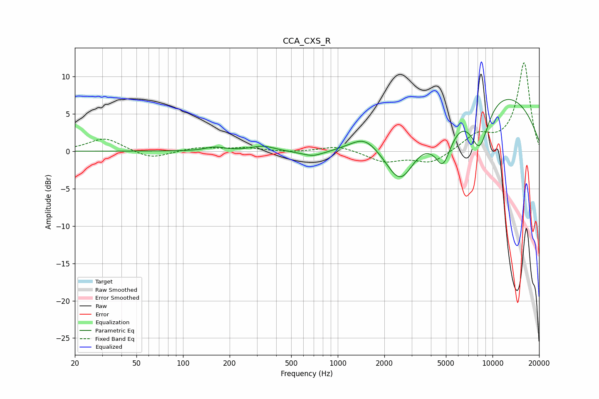

# CCA_CXS_R
See [usage instructions](https://github.com/jaakkopasanen/AutoEq#usage) for more options and info.

### Parametric EQs
Apply preamp of -7.0 dB when using parametric equalizer.

|   # | Type    |   Fc (Hz) |    Q |   Gain (dB) |
|-----|---------|-----------|------|-------------|
|   1 | Peaking |       161 | 2.42 |         0.5 |
|   2 | Peaking |       329 | 1.91 |         0.7 |
|   3 | Peaking |       688 | 3.64 |        -0.2 |
|   4 | Peaking |       703 | 1.34 |        -0.8 |
|   5 | Peaking |      1491 | 1.66 |         1.7 |
|   6 | Peaking |      2543 | 1.39 |        -6.9 |
|   7 | Peaking |      4560 | 2.92 |         2.5 |
|   8 | Peaking |      4705 | 2.29 |        -8.7 |
|   9 | Peaking |      8237 | 2.03 |        -6.8 |
|  10 | Peaking |      9197 | 0.28 |         8.7 |

### Fixed Band EQs
When using fixed band (also called graphic) equalizer, apply preamp of **-11.9 dB** (if available) and set gains manually with these parameters.

|   # | Type    |   Fc (Hz) |    Q |   Gain (dB) |
|-----|---------|-----------|------|-------------|
|   1 | Peaking |        31 | 1.41 |         1.8 |
|   2 | Peaking |        62 | 1.41 |        -1.1 |
|   3 | Peaking |       125 | 1.41 |         0.5 |
|   4 | Peaking |       250 | 1.41 |         0.4 |
|   5 | Peaking |       500 | 1.41 |        -0.2 |
|   6 | Peaking |      1000 | 1.41 |         0.8 |
|   7 | Peaking |      2000 | 1.41 |        -1.4 |
|   8 | Peaking |      4000 | 1.41 |        -1.6 |
|   9 | Peaking |      8000 | 1.41 |         2.1 |
|  10 | Peaking |     16000 | 1.41 |        11.8 |

### Graphs

