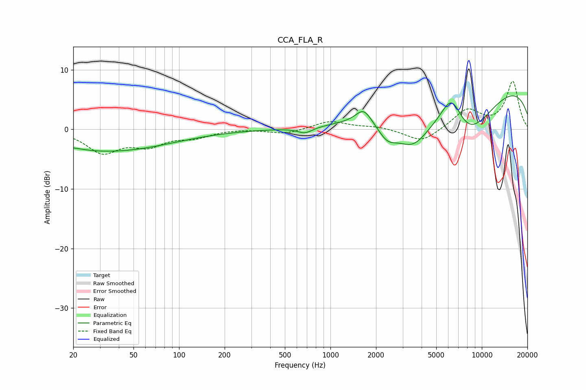

# CCA_FLA_R
See [usage instructions](https://github.com/jaakkopasanen/AutoEq#usage) for more options and info.

### Parametric EQs
Apply preamp of -5.7 dB when using parametric equalizer.

|   # | Type    |   Fc (Hz) |    Q |   Gain (dB) |
|-----|---------|-----------|------|-------------|
|   1 | Peaking |        21 | 3.24 |         0.1 |
|   2 | Peaking |        27 | 0.55 |        -0.1 |
|   3 | Peaking |        34 | 0.34 |        -3.5 |
|   4 | Peaking |       680 | 2.81 |        -1   |
|   5 | Peaking |      1657 | 2.72 |         2.5 |
|   6 | Peaking |      2375 | 2.16 |        -2.8 |
|   7 | Peaking |      3487 | 1.2  |        -5.8 |
|   8 | Peaking |      6314 | 1.87 |         6   |
|   9 | Peaking |      7886 | 0.67 |        -9.9 |
|  10 | Peaking |      9813 | 0.2  |         9.3 |

### Fixed Band EQs
When using fixed band (also called graphic) equalizer, apply preamp of **-8.2 dB** (if available) and set gains manually with these parameters.

|   # | Type    |   Fc (Hz) |    Q |   Gain (dB) |
|-----|---------|-----------|------|-------------|
|   1 | Peaking |        31 | 1.41 |        -3.7 |
|   2 | Peaking |        62 | 1.41 |        -2.4 |
|   3 | Peaking |       125 | 1.41 |        -1.2 |
|   4 | Peaking |       250 | 1.41 |         0.1 |
|   5 | Peaking |       500 | 1.41 |        -0.8 |
|   6 | Peaking |      1000 | 1.41 |         1.4 |
|   7 | Peaking |      2000 | 1.41 |         0.4 |
|   8 | Peaking |      4000 | 1.41 |        -2.3 |
|   9 | Peaking |      8000 | 1.41 |         3.3 |
|  10 | Peaking |     16000 | 1.41 |         8   |

### Graphs

