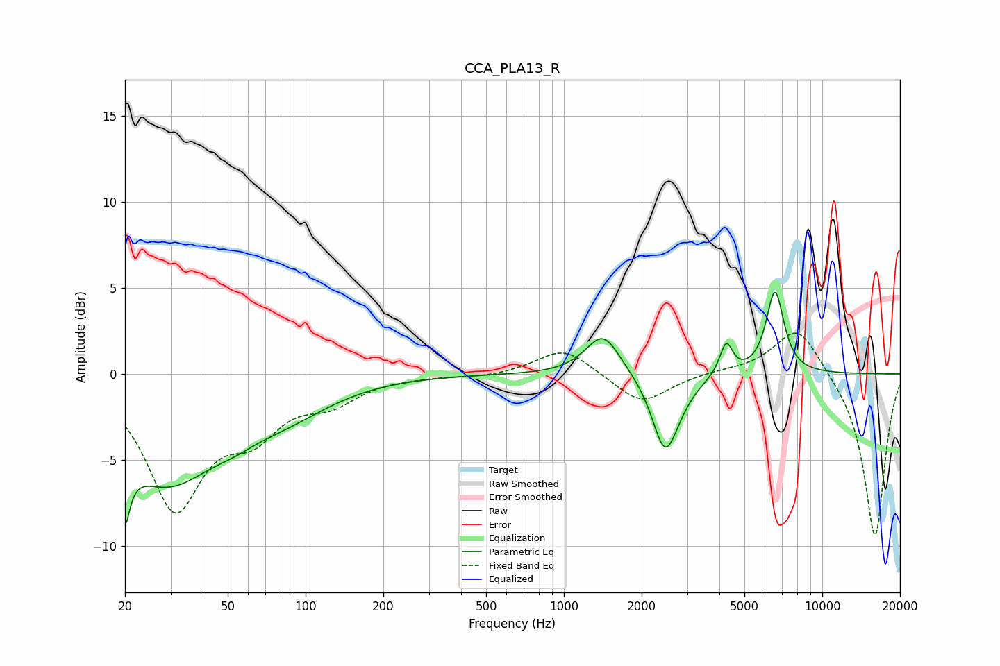

# CCA_PLA13_R
See [usage instructions](https://github.com/jaakkopasanen/AutoEq#usage) for more options and info.

### Parametric EQs
Apply preamp of -4.8 dB when using parametric equalizer.

|   # | Type    |   Fc (Hz) |    Q |   Gain (dB) |
|-----|---------|-----------|------|-------------|
|   1 | Peaking |        20 | 5.96 |        -6.9 |
|   2 | Peaking |        20 | 5.85 |         3.1 |
|   3 | Peaking |        29 | 0.7  |        -6   |
|   4 | Peaking |        53 | 1.9  |        -0.4 |
|   5 | Peaking |        82 | 0.75 |        -1.7 |
|   6 | Peaking |      1418 | 2.13 |         2.4 |
|   7 | Peaking |      2460 | 2.9  |        -4.1 |
|   8 | Peaking |      2750 | 2.06 |        -0.7 |
|   9 | Peaking |      4249 | 5.65 |         1.9 |
|  10 | Peaking |      6564 | 4.01 |         4.8 |

### Fixed Band EQs
When using fixed band (also called graphic) equalizer, apply preamp of **-2.5 dB** (if available) and set gains manually with these parameters.

|   # | Type    |   Fc (Hz) |    Q |   Gain (dB) |
|-----|---------|-----------|------|-------------|
|   1 | Peaking |        31 | 1.41 |        -7.5 |
|   2 | Peaking |        62 | 1.41 |        -2.7 |
|   3 | Peaking |       125 | 1.41 |        -1.4 |
|   4 | Peaking |       250 | 1.41 |        -0.1 |
|   5 | Peaking |       500 | 1.41 |        -0.2 |
|   6 | Peaking |      1000 | 1.41 |         1.6 |
|   7 | Peaking |      2000 | 1.41 |        -1.8 |
|   8 | Peaking |      4000 | 1.41 |         0.1 |
|   9 | Peaking |      8000 | 1.41 |         2.9 |
|  10 | Peaking |     16000 | 1.41 |        -9.6 |

### Graphs

