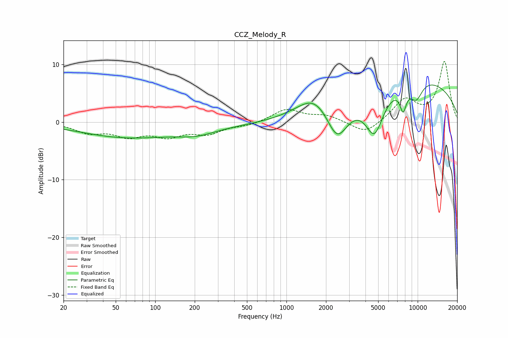

# CCZ_Melody_R
See [usage instructions](https://github.com/jaakkopasanen/AutoEq#usage) for more options and info.

### Parametric EQs
Apply preamp of -6.5 dB when using parametric equalizer.

|   # | Type    |   Fc (Hz) |    Q |   Gain (dB) |
|-----|---------|-----------|------|-------------|
|   1 | Peaking |        58 | 0.4  |        -2.2 |
|   2 | Peaking |       169 | 0.2  |        -0.6 |
|   3 | Peaking |       208 | 0.96 |        -1.2 |
|   4 | Peaking |      1633 | 1.12 |         3.4 |
|   5 | Peaking |      2435 | 1.66 |        -6.8 |
|   6 | Peaking |      4680 | 1.98 |        -7.3 |
|   7 | Peaking |      7745 | 5.4  |        -3.7 |
|   8 | Peaking |      8988 | 0.21 |         6.4 |
|   9 | Peaking |      9742 | 2.51 |        -3.2 |
|  10 | Peaking |      9754 | 0.57 |         1.5 |

### Fixed Band EQs
When using fixed band (also called graphic) equalizer, apply preamp of **-10.6 dB** (if available) and set gains manually with these parameters.

|   # | Type    |   Fc (Hz) |    Q |   Gain (dB) |
|-----|---------|-----------|------|-------------|
|   1 | Peaking |        31 | 1.41 |        -1.7 |
|   2 | Peaking |        62 | 1.41 |        -2.1 |
|   3 | Peaking |       125 | 1.41 |        -2.1 |
|   4 | Peaking |       250 | 1.41 |        -1.8 |
|   5 | Peaking |       500 | 1.41 |        -0.6 |
|   6 | Peaking |      1000 | 1.41 |         2.2 |
|   7 | Peaking |      2000 | 1.41 |         1.1 |
|   8 | Peaking |      4000 | 1.41 |        -2.2 |
|   9 | Peaking |      8000 | 1.41 |         3.8 |
|  10 | Peaking |     16000 | 1.41 |        10.4 |

### Graphs

