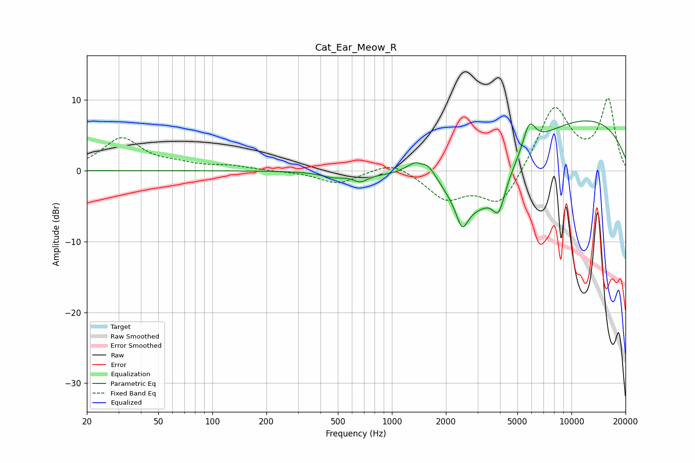

# Cat_Ear_Meow_R
See [usage instructions](https://github.com/jaakkopasanen/AutoEq#usage) for more options and info.

### Parametric EQs
Apply preamp of -7.1 dB when using parametric equalizer.

|   # | Type    |   Fc (Hz) |    Q |   Gain (dB) |
|-----|---------|-----------|------|-------------|
|   1 | Peaking |       375 | 2.67 |        -0   |
|   2 | Peaking |       473 | 2.24 |        -0.6 |
|   3 | Peaking |       668 | 3.49 |        -1.1 |
|   4 | Peaking |      1465 | 5.97 |        -0.7 |
|   5 | Peaking |      1488 | 1.85 |         4.7 |
|   6 | Peaking |      2461 | 4.59 |        -3.5 |
|   7 | Peaking |      2915 | 0.68 |        -9.5 |
|   8 | Peaking |      3938 | 4.15 |        -4   |
|   9 | Peaking |      5818 | 3.83 |         4   |
|  10 | Peaking |      9788 | 0.24 |         8   |

### Fixed Band EQs
When using fixed band (also called graphic) equalizer, apply preamp of **-10.3 dB** (if available) and set gains manually with these parameters.

|   # | Type    |   Fc (Hz) |    Q |   Gain (dB) |
|-----|---------|-----------|------|-------------|
|   1 | Peaking |        31 | 1.41 |         4.5 |
|   2 | Peaking |        62 | 1.41 |         0.7 |
|   3 | Peaking |       125 | 1.41 |         0.6 |
|   4 | Peaking |       250 | 1.41 |        -0.1 |
|   5 | Peaking |       500 | 1.41 |        -1.8 |
|   6 | Peaking |      1000 | 1.41 |         1.5 |
|   7 | Peaking |      2000 | 1.41 |        -3.8 |
|   8 | Peaking |      4000 | 1.41 |        -5.1 |
|   9 | Peaking |      8000 | 1.41 |         9.2 |
|  10 | Peaking |     16000 | 1.41 |         9.8 |

### Graphs

