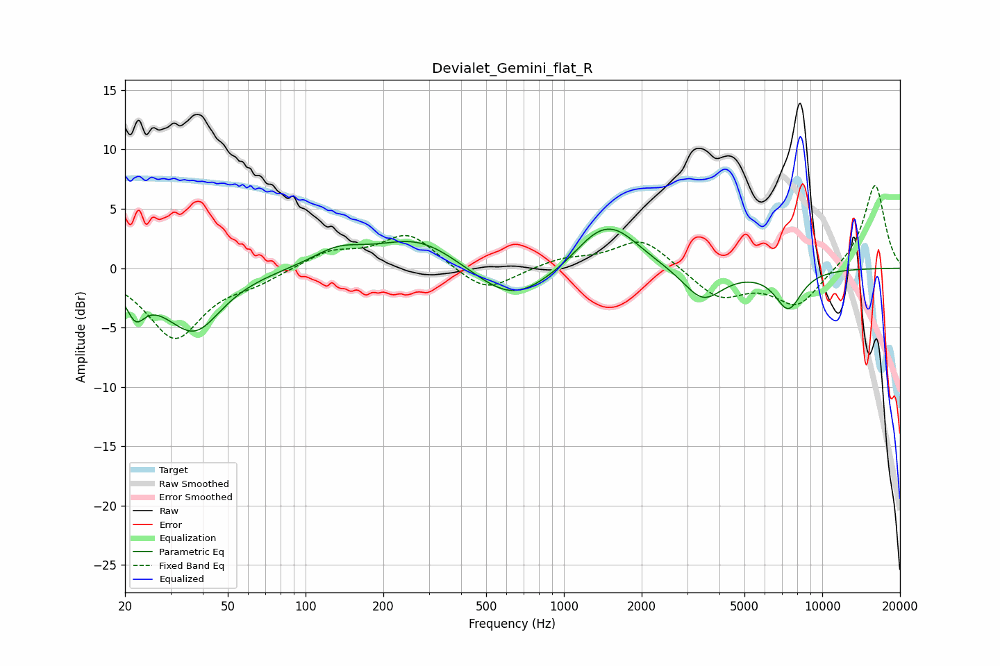

# Devialet_Gemini_flat_R
See [usage instructions](https://github.com/jaakkopasanen/AutoEq#usage) for more options and info.

### Parametric EQs
Apply preamp of -3.4 dB when using parametric equalizer.

|   # | Type    |   Fc (Hz) |    Q |   Gain (dB) |
|-----|---------|-----------|------|-------------|
|   1 | Peaking |        22 | 4.03 |        -2.4 |
|   2 | Peaking |        34 | 0.95 |        -2.4 |
|   3 | Peaking |        38 | 1.54 |        -3   |
|   4 | Peaking |       133 | 1.4  |         1.4 |
|   5 | Peaking |       274 | 0.88 |         2.6 |
|   6 | Peaking |       630 | 0.96 |        -3.1 |
|   7 | Peaking |      1284 | 1.72 |         1   |
|   8 | Peaking |      1550 | 1.3  |         3.3 |
|   9 | Peaking |      3450 | 1.82 |        -2.8 |
|  10 | Peaking |      7388 | 2.59 |        -3.3 |

### Fixed Band EQs
When using fixed band (also called graphic) equalizer, apply preamp of **-7.1 dB** (if available) and set gains manually with these parameters.

|   # | Type    |   Fc (Hz) |    Q |   Gain (dB) |
|-----|---------|-----------|------|-------------|
|   1 | Peaking |        31 | 1.41 |        -5.8 |
|   2 | Peaking |        62 | 1.41 |        -0.9 |
|   3 | Peaking |       125 | 1.41 |         1.4 |
|   4 | Peaking |       250 | 1.41 |         2.9 |
|   5 | Peaking |       500 | 1.41 |        -2.2 |
|   6 | Peaking |      1000 | 1.41 |         0.8 |
|   7 | Peaking |      2000 | 1.41 |         2.6 |
|   8 | Peaking |      4000 | 1.41 |        -2.5 |
|   9 | Peaking |      8000 | 1.41 |        -3.1 |
|  10 | Peaking |     16000 | 1.41 |         7.2 |

### Graphs

