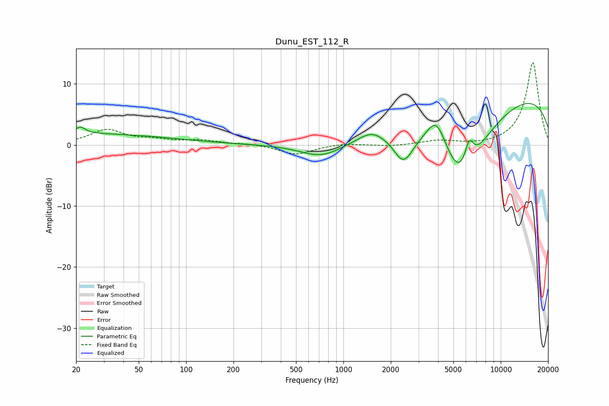

# Dunu_EST_112_R
See [usage instructions](https://github.com/jaakkopasanen/AutoEq#usage) for more options and info.

### Parametric EQs
Apply preamp of -6.9 dB when using parametric equalizer.

|   # | Type    |   Fc (Hz) |    Q |   Gain (dB) |
|-----|---------|-----------|------|-------------|
|   1 | Peaking |        20 | 0.21 |         1.8 |
|   2 | Peaking |        21 | 4.81 |         1.5 |
|   3 | Peaking |        21 | 5.48 |        -0.5 |
|   4 | Peaking |       733 | 1.04 |        -2.4 |
|   5 | Peaking |      1507 | 1.94 |         1.3 |
|   6 | Peaking |      2407 | 2.24 |        -4.8 |
|   7 | Peaking |      3905 | 2.18 |         5.3 |
|   8 | Peaking |      5611 | 0.85 |       -14   |
|   9 | Peaking |      6294 | 4.55 |         4.2 |
|  10 | Peaking |      9544 | 0.18 |         9.2 |

### Fixed Band EQs
When using fixed band (also called graphic) equalizer, apply preamp of **-13.5 dB** (if available) and set gains manually with these parameters.

|   # | Type    |   Fc (Hz) |    Q |   Gain (dB) |
|-----|---------|-----------|------|-------------|
|   1 | Peaking |        31 | 1.41 |         2.4 |
|   2 | Peaking |        62 | 1.41 |         0.7 |
|   3 | Peaking |       125 | 1.41 |         0.7 |
|   4 | Peaking |       250 | 1.41 |         0.2 |
|   5 | Peaking |       500 | 1.41 |        -1.6 |
|   6 | Peaking |      1000 | 1.41 |         0.3 |
|   7 | Peaking |      2000 | 1.41 |        -0.2 |
|   8 | Peaking |      4000 | 1.41 |         0.7 |
|   9 | Peaking |      8000 | 1.41 |        -0.2 |
|  10 | Peaking |     16000 | 1.41 |        13.5 |

### Graphs

