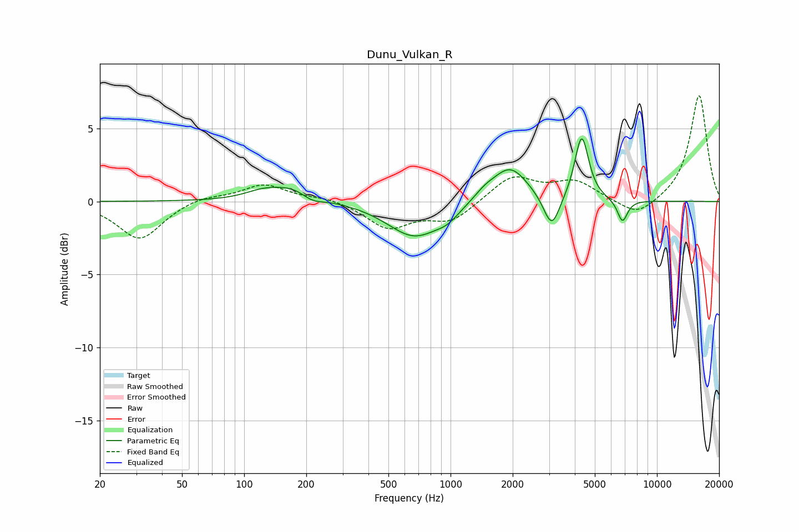

# Dunu_Vulkan_R
See [usage instructions](https://github.com/jaakkopasanen/AutoEq#usage) for more options and info.

### Parametric EQs
Apply preamp of -4.4 dB when using parametric equalizer.

|   # | Type    |   Fc (Hz) |    Q |   Gain (dB) |
|-----|---------|-----------|------|-------------|
|   1 | Peaking |       122 | 1.67 |         0.5 |
|   2 | Peaking |       178 | 1.28 |         1.1 |
|   3 | Peaking |       212 | 2.36 |        -0.7 |
|   4 | Peaking |       669 | 1.09 |        -2.4 |
|   5 | Peaking |       967 | 2.57 |        -0.5 |
|   6 | Peaking |      1457 | 2.66 |         0.5 |
|   7 | Peaking |      1941 | 1.63 |         2.4 |
|   8 | Peaking |      3091 | 3.6  |        -2.4 |
|   9 | Peaking |      4318 | 4.19 |         4.5 |
|  10 | Peaking |      6805 | 5.58 |        -1.5 |

### Fixed Band EQs
When using fixed band (also called graphic) equalizer, apply preamp of **-7.3 dB** (if available) and set gains manually with these parameters.

|   # | Type    |   Fc (Hz) |    Q |   Gain (dB) |
|-----|---------|-----------|------|-------------|
|   1 | Peaking |        31 | 1.41 |        -2.6 |
|   2 | Peaking |        62 | 1.41 |         0.4 |
|   3 | Peaking |       125 | 1.41 |         1.2 |
|   4 | Peaking |       250 | 1.41 |         0.3 |
|   5 | Peaking |       500 | 1.41 |        -1.8 |
|   6 | Peaking |      1000 | 1.41 |        -1.3 |
|   7 | Peaking |      2000 | 1.41 |         1.7 |
|   8 | Peaking |      4000 | 1.41 |         1.3 |
|   9 | Peaking |      8000 | 1.41 |        -1.2 |
|  10 | Peaking |     16000 | 1.41 |         7.3 |

### Graphs

