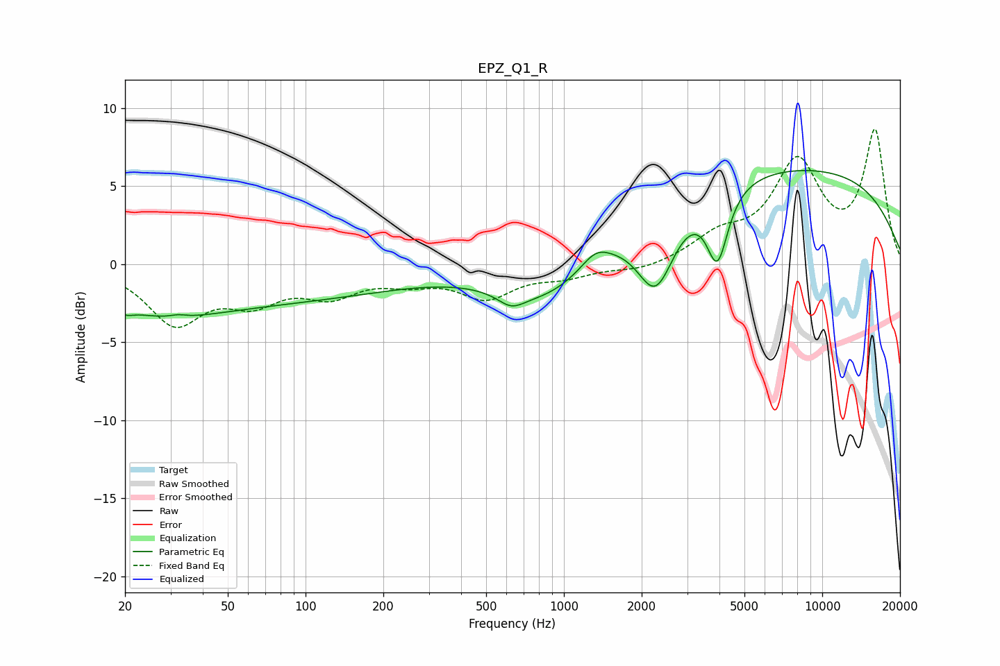

# EPZ_Q1_R
See [usage instructions](https://github.com/jaakkopasanen/AutoEq#usage) for more options and info.

### Parametric EQs
Apply preamp of -6.1 dB when using parametric equalizer.

|   # | Type    |   Fc (Hz) |    Q |   Gain (dB) |
|-----|---------|-----------|------|-------------|
|   1 | Peaking |        20 | 4.75 |        -0.4 |
|   2 | Peaking |        27 | 0.65 |        -1.4 |
|   3 | Peaking |        32 | 4.89 |         0.2 |
|   4 | Peaking |        60 | 0.24 |        -2.3 |
|   5 | Peaking |       625 | 2.71 |        -0.9 |
|   6 | Peaking |       875 | 0.73 |        -3   |
|   7 | Peaking |      1327 | 2.54 |         1   |
|   8 | Peaking |      2271 | 1.91 |        -5   |
|   9 | Peaking |      3929 | 3.43 |        -4.6 |
|  10 | Peaking |      6987 | 0.2  |         6.3 |

### Fixed Band EQs
When using fixed band (also called graphic) equalizer, apply preamp of **-8.7 dB** (if available) and set gains manually with these parameters.

|   # | Type    |   Fc (Hz) |    Q |   Gain (dB) |
|-----|---------|-----------|------|-------------|
|   1 | Peaking |        31 | 1.41 |        -3.6 |
|   2 | Peaking |        62 | 1.41 |        -2   |
|   3 | Peaking |       125 | 1.41 |        -1.7 |
|   4 | Peaking |       250 | 1.41 |        -0.9 |
|   5 | Peaking |       500 | 1.41 |        -2   |
|   6 | Peaking |      1000 | 1.41 |        -0.7 |
|   7 | Peaking |      2000 | 1.41 |        -0.4 |
|   8 | Peaking |      4000 | 1.41 |         1.5 |
|   9 | Peaking |      8000 | 1.41 |         6.2 |
|  10 | Peaking |     16000 | 1.41 |         8.3 |

### Graphs

