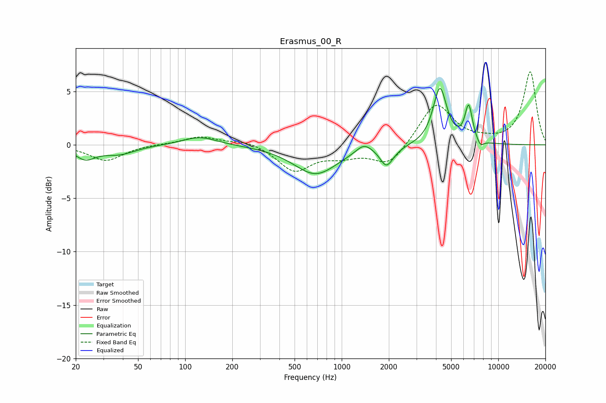

# Erasmus_00_R
See [usage instructions](https://github.com/jaakkopasanen/AutoEq#usage) for more options and info.

### Parametric EQs
Apply preamp of -5.4 dB when using parametric equalizer.

|   # | Type    |   Fc (Hz) |    Q |   Gain (dB) |
|-----|---------|-----------|------|-------------|
|   1 | Peaking |        23 | 2.2  |        -1.2 |
|   2 | Peaking |        38 | 1.34 |        -0.8 |
|   3 | Peaking |       124 | 1.29 |         0.8 |
|   4 | Peaking |       681 | 1.01 |        -2.7 |
|   5 | Peaking |      1387 | 2.9  |         0.8 |
|   6 | Peaking |      1925 | 3.61 |        -1.6 |
|   7 | Peaking |      2144 | 2.7  |        -0.3 |
|   8 | Peaking |      4238 | 3.26 |         5.3 |
|   9 | Peaking |      6472 | 5.7  |         3.4 |
|  10 | Peaking |      7676 | 6    |        -0.7 |

### Fixed Band EQs
When using fixed band (also called graphic) equalizer, apply preamp of **-6.9 dB** (if available) and set gains manually with these parameters.

|   # | Type    |   Fc (Hz) |    Q |   Gain (dB) |
|-----|---------|-----------|------|-------------|
|   1 | Peaking |        31 | 1.41 |        -1.5 |
|   2 | Peaking |        62 | 1.41 |         0.1 |
|   3 | Peaking |       125 | 1.41 |         0.8 |
|   4 | Peaking |       250 | 1.41 |         0.4 |
|   5 | Peaking |       500 | 1.41 |        -2.4 |
|   6 | Peaking |      1000 | 1.41 |        -0.8 |
|   7 | Peaking |      2000 | 1.41 |        -2   |
|   8 | Peaking |      4000 | 1.41 |         4   |
|   9 | Peaking |      8000 | 1.41 |         0.2 |
|  10 | Peaking |     16000 | 1.41 |         6.8 |

### Graphs

