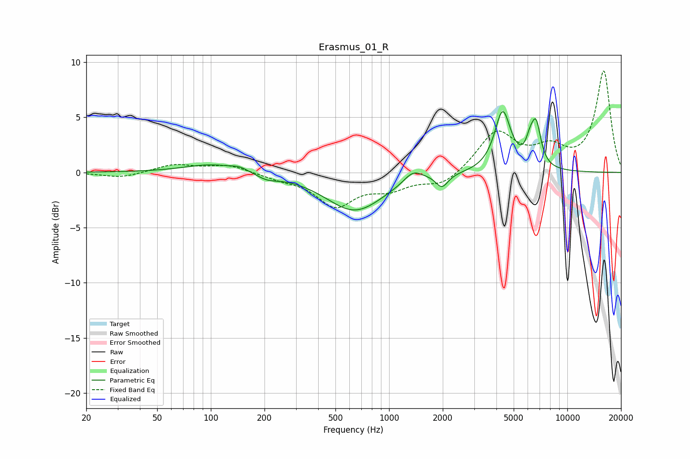

# Erasmus_01_R
See [usage instructions](https://github.com/jaakkopasanen/AutoEq#usage) for more options and info.

### Parametric EQs
Apply preamp of -5.6 dB when using parametric equalizer.

|   # | Type    |   Fc (Hz) |    Q |   Gain (dB) |
|-----|---------|-----------|------|-------------|
|   1 | Peaking |       102 | 0.92 |         0.8 |
|   2 | Peaking |       145 | 3.01 |         0.3 |
|   3 | Peaking |       207 | 2.33 |        -0.5 |
|   4 | Peaking |       643 | 0.87 |        -3.5 |
|   5 | Peaking |      1363 | 2.79 |         1   |
|   6 | Peaking |      1845 | 2.31 |         0.2 |
|   7 | Peaking |      1973 | 4.01 |        -1.3 |
|   8 | Peaking |      4338 | 3.11 |         5.4 |
|   9 | Peaking |      6166 | 5.86 |         1.4 |
|  10 | Peaking |      6679 | 5.03 |         3.7 |

### Fixed Band EQs
When using fixed band (also called graphic) equalizer, apply preamp of **-9.3 dB** (if available) and set gains manually with these parameters.

|   # | Type    |   Fc (Hz) |    Q |   Gain (dB) |
|-----|---------|-----------|------|-------------|
|   1 | Peaking |        31 | 1.41 |        -0.5 |
|   2 | Peaking |        62 | 1.41 |         0.7 |
|   3 | Peaking |       125 | 1.41 |         0.7 |
|   4 | Peaking |       250 | 1.41 |        -0.4 |
|   5 | Peaking |       500 | 1.41 |        -2.9 |
|   6 | Peaking |      1000 | 1.41 |        -1.3 |
|   7 | Peaking |      2000 | 1.41 |        -1.2 |
|   8 | Peaking |      4000 | 1.41 |         3.6 |
|   9 | Peaking |      8000 | 1.41 |         1.9 |
|  10 | Peaking |     16000 | 1.41 |         9.1 |

### Graphs

