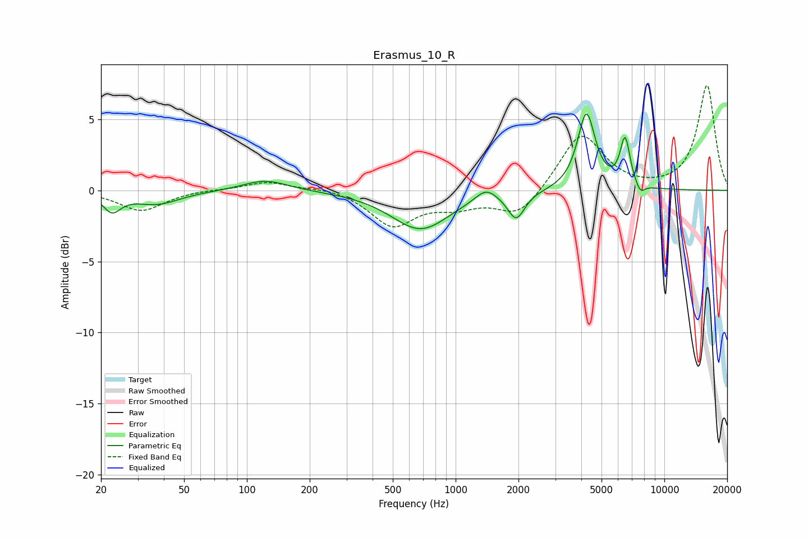

# Erasmus_10_R
See [usage instructions](https://github.com/jaakkopasanen/AutoEq#usage) for more options and info.

### Parametric EQs
Apply preamp of -5.4 dB when using parametric equalizer.

|   # | Type    |   Fc (Hz) |    Q |   Gain (dB) |
|-----|---------|-----------|------|-------------|
|   1 | Peaking |        23 | 3.41 |        -1.3 |
|   2 | Peaking |        37 | 1.26 |        -0.9 |
|   3 | Peaking |       123 | 1.34 |         0.8 |
|   4 | Peaking |       679 | 1.02 |        -2.7 |
|   5 | Peaking |      1398 | 2.85 |         0.8 |
|   6 | Peaking |      1946 | 2.7  |        -0.2 |
|   7 | Peaking |      1951 | 3.62 |        -1.7 |
|   8 | Peaking |      4231 | 3.35 |         5.4 |
|   9 | Peaking |      6484 | 5.72 |         3.4 |
|  10 | Peaking |      7660 | 6    |        -0.7 |

### Fixed Band EQs
When using fixed band (also called graphic) equalizer, apply preamp of **-7.5 dB** (if available) and set gains manually with these parameters.

|   # | Type    |   Fc (Hz) |    Q |   Gain (dB) |
|-----|---------|-----------|------|-------------|
|   1 | Peaking |        31 | 1.41 |        -1.4 |
|   2 | Peaking |        62 | 1.41 |         0.1 |
|   3 | Peaking |       125 | 1.41 |         0.6 |
|   4 | Peaking |       250 | 1.41 |         0.2 |
|   5 | Peaking |       500 | 1.41 |        -2.4 |
|   6 | Peaking |      1000 | 1.41 |        -0.9 |
|   7 | Peaking |      2000 | 1.41 |        -1.9 |
|   8 | Peaking |      4000 | 1.41 |         4.1 |
|   9 | Peaking |      8000 | 1.41 |        -0   |
|  10 | Peaking |     16000 | 1.41 |         7.4 |

### Graphs

