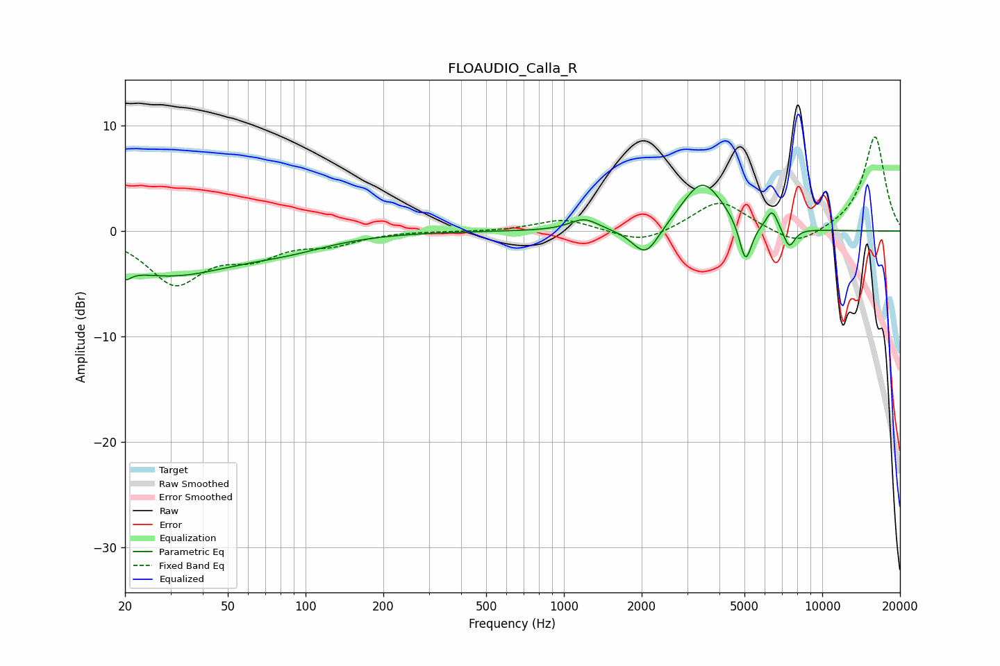

# FLOAUDIO_Calla_R
See [usage instructions](https://github.com/jaakkopasanen/AutoEq#usage) for more options and info.

### Parametric EQs
Apply preamp of -4.4 dB when using parametric equalizer.

|   # | Type    |   Fc (Hz) |    Q |   Gain (dB) |
|-----|---------|-----------|------|-------------|
|   1 | Peaking |        20 | 5.9  |        -4.2 |
|   2 | Peaking |        20 | 5.97 |         3.1 |
|   3 | Peaking |        29 | 0.53 |        -4   |
|   4 | Peaking |        86 | 0.85 |        -1   |
|   5 | Peaking |      1197 | 2.57 |         1.1 |
|   6 | Peaking |      2074 | 2.68 |        -2.9 |
|   7 | Peaking |      3437 | 1.75 |         4.8 |
|   8 | Peaking |      5049 | 5.76 |        -4   |
|   9 | Peaking |      6397 | 6    |         1.8 |
|  10 | Peaking |      7447 | 6    |        -1.9 |

### Fixed Band EQs
When using fixed band (also called graphic) equalizer, apply preamp of **-9.0 dB** (if available) and set gains manually with these parameters.

|   # | Type    |   Fc (Hz) |    Q |   Gain (dB) |
|-----|---------|-----------|------|-------------|
|   1 | Peaking |        31 | 1.41 |        -4.8 |
|   2 | Peaking |        62 | 1.41 |        -2   |
|   3 | Peaking |       125 | 1.41 |        -1.1 |
|   4 | Peaking |       250 | 1.41 |         0   |
|   5 | Peaking |       500 | 1.41 |        -0   |
|   6 | Peaking |      1000 | 1.41 |         1.2 |
|   7 | Peaking |      2000 | 1.41 |        -1.3 |
|   8 | Peaking |      4000 | 1.41 |         2.9 |
|   9 | Peaking |      8000 | 1.41 |        -1.6 |
|  10 | Peaking |     16000 | 1.41 |         9   |

### Graphs

