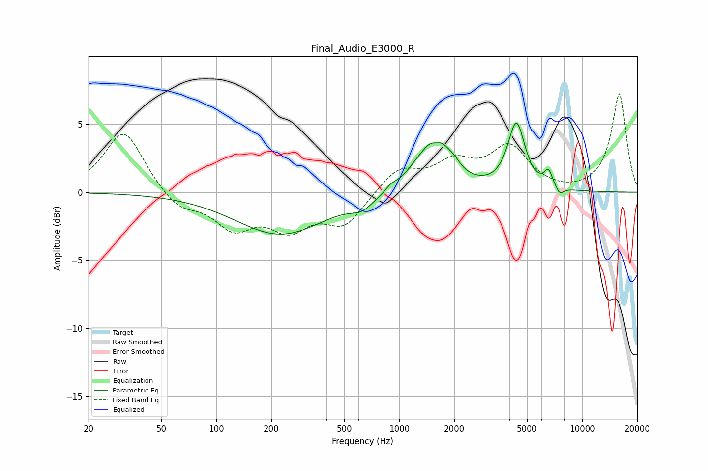

# Final_Audio_E3000_R
See [usage instructions](https://github.com/jaakkopasanen/AutoEq#usage) for more options and info.

### Parametric EQs
Apply preamp of -5.2 dB when using parametric equalizer.

|   # | Type    |   Fc (Hz) |    Q |   Gain (dB) |
|-----|---------|-----------|------|-------------|
|   1 | Peaking |       224 | 0.58 |        -3.1 |
|   2 | Peaking |       624 | 2.34 |        -0.7 |
|   3 | Peaking |       902 | 4.79 |         0.4 |
|   4 | Peaking |      1235 | 1.97 |         0.7 |
|   5 | Peaking |      1594 | 5.26 |        -0.4 |
|   6 | Peaking |      1606 | 1.76 |         3.8 |
|   7 | Peaking |      2008 | 5.25 |         0.3 |
|   8 | Peaking |      4367 | 3.04 |         4.9 |
|   9 | Peaking |      6540 | 5.99 |         1.2 |
|  10 | Peaking |      7548 | 6    |        -0.6 |

### Fixed Band EQs
When using fixed band (also called graphic) equalizer, apply preamp of **-7.3 dB** (if available) and set gains manually with these parameters.

|   # | Type    |   Fc (Hz) |    Q |   Gain (dB) |
|-----|---------|-----------|------|-------------|
|   1 | Peaking |        31 | 1.41 |         4.6 |
|   2 | Peaking |        62 | 1.41 |        -1.3 |
|   3 | Peaking |       125 | 1.41 |        -2.4 |
|   4 | Peaking |       250 | 1.41 |        -2.4 |
|   5 | Peaking |       500 | 1.41 |        -2.3 |
|   6 | Peaking |      1000 | 1.41 |         1.7 |
|   7 | Peaking |      2000 | 1.41 |         1.9 |
|   8 | Peaking |      4000 | 1.41 |         3.1 |
|   9 | Peaking |      8000 | 1.41 |        -0.2 |
|  10 | Peaking |     16000 | 1.41 |         7.2 |

### Graphs

