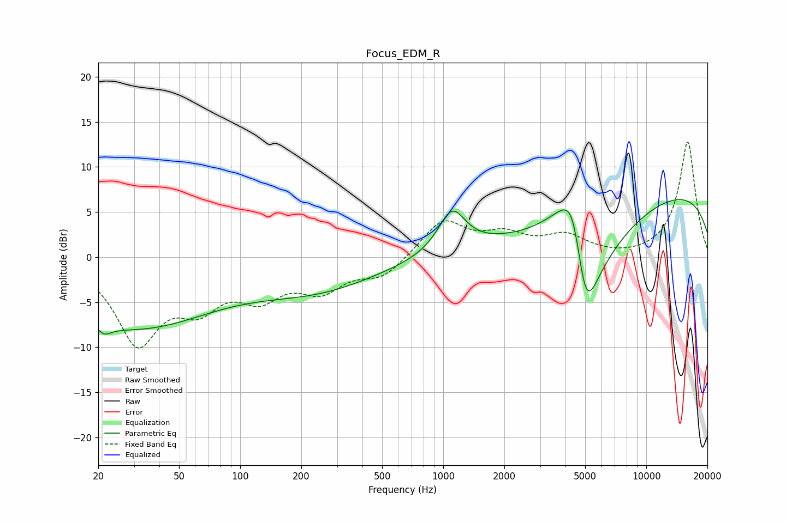

# Focus_EDM_R
See [usage instructions](https://github.com/jaakkopasanen/AutoEq#usage) for more options and info.

### Parametric EQs
Apply preamp of -6.5 dB when using parametric equalizer.

|   # | Type    |   Fc (Hz) |    Q |   Gain (dB) |
|-----|---------|-----------|------|-------------|
|   1 | Peaking |        20 | 5.54 |         2.7 |
|   2 | Peaking |        20 | 3.9  |        -3.7 |
|   3 | Peaking |        35 | 0.32 |        -9.4 |
|   4 | Peaking |        59 | 0.38 |         2.2 |
|   5 | Peaking |       245 | 0.47 |        -3.1 |
|   6 | Peaking |      1104 | 2.11 |         4.6 |
|   7 | Peaking |      4028 | 1.11 |         6   |
|   8 | Peaking |      4390 | 2.33 |         7.5 |
|   9 | Peaking |      4993 | 1.3  |       -20   |
|  10 | Peaking |     10000 | 0.18 |         7.9 |

### Fixed Band EQs
When using fixed band (also called graphic) equalizer, apply preamp of **-12.9 dB** (if available) and set gains manually with these parameters.

|   # | Type    |   Fc (Hz) |    Q |   Gain (dB) |
|-----|---------|-----------|------|-------------|
|   1 | Peaking |        31 | 1.41 |        -9.1 |
|   2 | Peaking |        62 | 1.41 |        -4.3 |
|   3 | Peaking |       125 | 1.41 |        -3.7 |
|   4 | Peaking |       250 | 1.41 |        -3.2 |
|   5 | Peaking |       500 | 1.41 |        -2.1 |
|   6 | Peaking |      1000 | 1.41 |         4.1 |
|   7 | Peaking |      2000 | 1.41 |         2.1 |
|   8 | Peaking |      4000 | 1.41 |         2.1 |
|   9 | Peaking |      8000 | 1.41 |        -0.2 |
|  10 | Peaking |     16000 | 1.41 |        12.9 |

### Graphs

