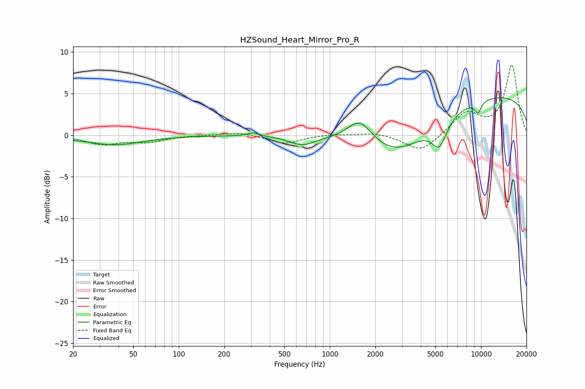

# HZSound_Heart_Mirror_Pro_R
See [usage instructions](https://github.com/jaakkopasanen/AutoEq#usage) for more options and info.

### Parametric EQs
Apply preamp of -4.6 dB when using parametric equalizer.

|   # | Type    |   Fc (Hz) |    Q |   Gain (dB) |
|-----|---------|-----------|------|-------------|
|   1 | Peaking |        27 | 1.47 |         0.2 |
|   2 | Peaking |        35 | 0.71 |        -1.2 |
|   3 | Peaking |       312 | 3.65 |         0.4 |
|   4 | Peaking |       656 | 1.71 |        -1.1 |
|   5 | Peaking |      1580 | 1.66 |         3   |
|   6 | Peaking |      2812 | 0.6  |        -5   |
|   7 | Peaking |      5303 | 2.77 |        -3.1 |
|   8 | Peaking |      9552 | 5.74 |        -1.4 |
|   9 | Peaking |      9707 | 5.04 |         0   |
|  10 | Peaking |     10000 | 0.18 |         5   |

### Fixed Band EQs
When using fixed band (also called graphic) equalizer, apply preamp of **-8.5 dB** (if available) and set gains manually with these parameters.

|   # | Type    |   Fc (Hz) |    Q |   Gain (dB) |
|-----|---------|-----------|------|-------------|
|   1 | Peaking |        31 | 1.41 |        -1   |
|   2 | Peaking |        62 | 1.41 |        -0.7 |
|   3 | Peaking |       125 | 1.41 |         0   |
|   4 | Peaking |       250 | 1.41 |         0.4 |
|   5 | Peaking |       500 | 1.41 |        -1   |
|   6 | Peaking |      1000 | 1.41 |         0.1 |
|   7 | Peaking |      2000 | 1.41 |         0.4 |
|   8 | Peaking |      4000 | 1.41 |        -2.1 |
|   9 | Peaking |      8000 | 1.41 |         2.7 |
|  10 | Peaking |     16000 | 1.41 |         8.4 |

### Graphs

