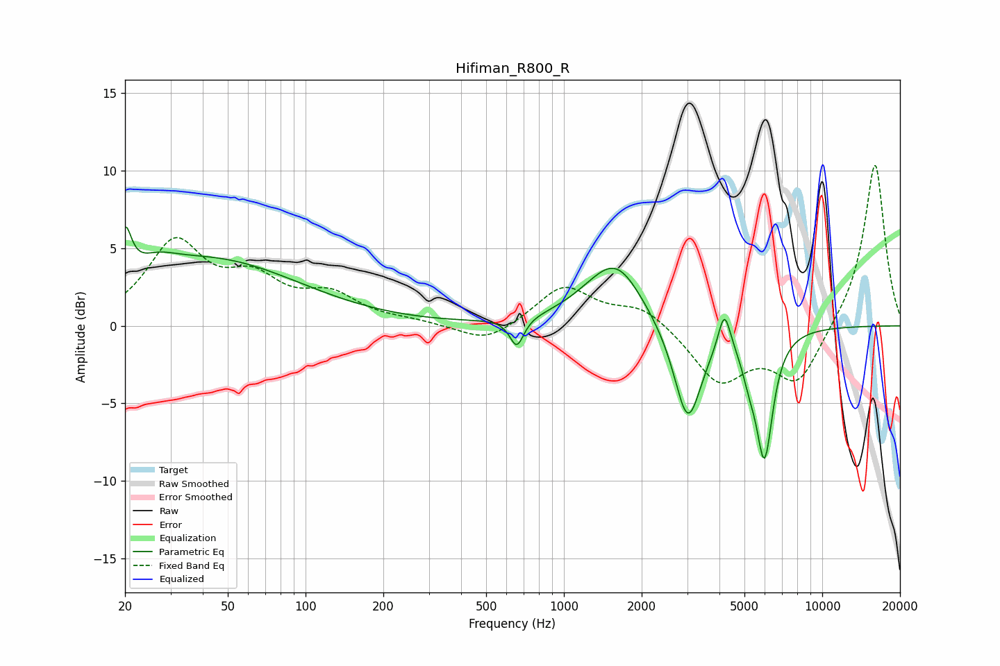

# Hifiman_R800_R
See [usage instructions](https://github.com/jaakkopasanen/AutoEq#usage) for more options and info.

### Parametric EQs
Apply preamp of -6.5 dB when using parametric equalizer.

|   # | Type    |   Fc (Hz) |    Q |   Gain (dB) |
|-----|---------|-----------|------|-------------|
|   1 | Peaking |        20 | 5.85 |         3.1 |
|   2 | Peaking |        27 | 1.9  |         0.8 |
|   3 | Peaking |        42 | 0.4  |         4.2 |
|   4 | Peaking |       657 | 5.25 |        -1.8 |
|   5 | Peaking |      1293 | 1.22 |         0.8 |
|   6 | Peaking |      1609 | 1.4  |         3.5 |
|   7 | Peaking |      3017 | 2.62 |        -6.4 |
|   8 | Peaking |      4181 | 5.99 |         2.6 |
|   9 | Peaking |      5214 | 4.85 |        -1.5 |
|  10 | Peaking |      5976 | 4.16 |        -8   |

### Fixed Band EQs
When using fixed band (also called graphic) equalizer, apply preamp of **-10.4 dB** (if available) and set gains manually with these parameters.

|   # | Type    |   Fc (Hz) |    Q |   Gain (dB) |
|-----|---------|-----------|------|-------------|
|   1 | Peaking |        31 | 1.41 |         5.1 |
|   2 | Peaking |        62 | 1.41 |         2.5 |
|   3 | Peaking |       125 | 1.41 |         1.7 |
|   4 | Peaking |       250 | 1.41 |         0.2 |
|   5 | Peaking |       500 | 1.41 |        -1.2 |
|   6 | Peaking |      1000 | 1.41 |         2.6 |
|   7 | Peaking |      2000 | 1.41 |         1.3 |
|   8 | Peaking |      4000 | 1.41 |        -3.5 |
|   9 | Peaking |      8000 | 1.41 |        -3.7 |
|  10 | Peaking |     16000 | 1.41 |        10.6 |

### Graphs

