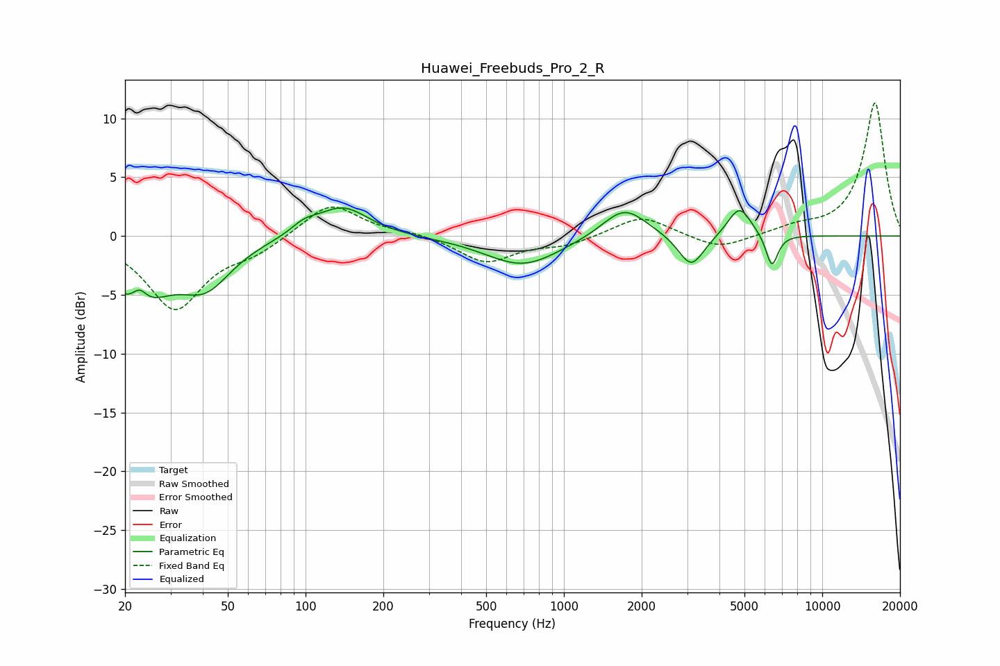

# Huawei_Freebuds_Pro_2_R
See [usage instructions](https://github.com/jaakkopasanen/AutoEq#usage) for more options and info.

### Parametric EQs
Apply preamp of -2.5 dB when using parametric equalizer.

|   # | Type    |   Fc (Hz) |    Q |   Gain (dB) |
|-----|---------|-----------|------|-------------|
|   1 | Peaking |        22 | 1.2  |        -5.3 |
|   2 | Peaking |        23 | 4.83 |         1.4 |
|   3 | Peaking |        41 | 1.43 |        -3.5 |
|   4 | Peaking |        99 | 2.78 |         0.8 |
|   5 | Peaking |       139 | 1.41 |         2.6 |
|   6 | Peaking |       694 | 0.98 |        -2.6 |
|   7 | Peaking |      1714 | 1.64 |         2.6 |
|   8 | Peaking |      3111 | 2.82 |        -2.8 |
|   9 | Peaking |      4781 | 3.03 |         2.6 |
|  10 | Peaking |      6383 | 5.82 |        -2.8 |

### Fixed Band EQs
When using fixed band (also called graphic) equalizer, apply preamp of **-11.4 dB** (if available) and set gains manually with these parameters.

|   # | Type    |   Fc (Hz) |    Q |   Gain (dB) |
|-----|---------|-----------|------|-------------|
|   1 | Peaking |        31 | 1.41 |        -6.1 |
|   2 | Peaking |        62 | 1.41 |        -1.2 |
|   3 | Peaking |       125 | 1.41 |         2.9 |
|   4 | Peaking |       250 | 1.41 |         0.3 |
|   5 | Peaking |       500 | 1.41 |        -2.2 |
|   6 | Peaking |      1000 | 1.41 |        -0.7 |
|   7 | Peaking |      2000 | 1.41 |         1.8 |
|   8 | Peaking |      4000 | 1.41 |        -1.2 |
|   9 | Peaking |      8000 | 1.41 |         0.6 |
|  10 | Peaking |     16000 | 1.41 |        11.4 |

### Graphs

