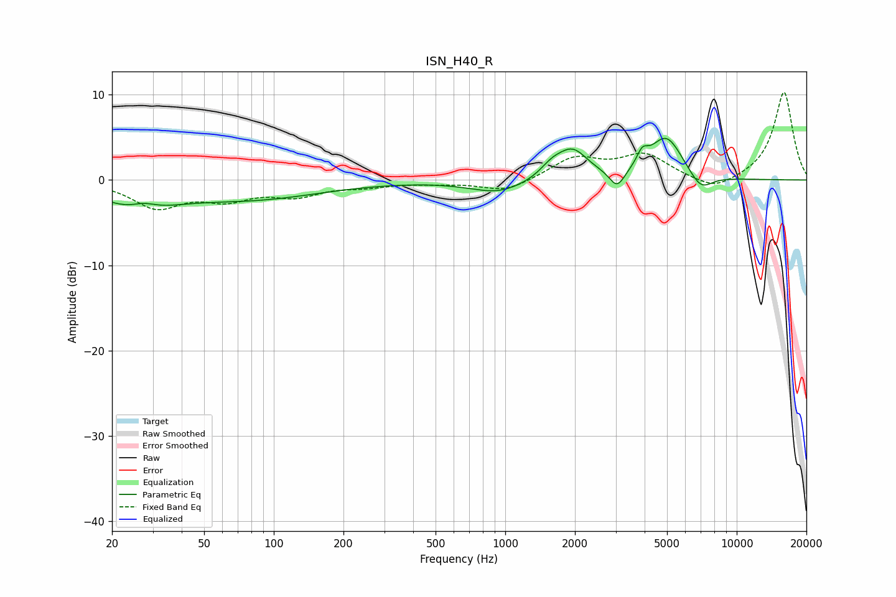

# ISN_H40_R
See [usage instructions](https://github.com/jaakkopasanen/AutoEq#usage) for more options and info.

### Parametric EQs
Apply preamp of -5.0 dB when using parametric equalizer.

|   # | Type    |   Fc (Hz) |    Q |   Gain (dB) |
|-----|---------|-----------|------|-------------|
|   1 | Peaking |        26 | 0.94 |        -2.9 |
|   2 | Peaking |        27 | 2.49 |         1   |
|   3 | Peaking |        80 | 0.46 |        -2.1 |
|   4 | Peaking |       935 | 1.16 |        -1.5 |
|   5 | Peaking |      1588 | 2.83 |         1.2 |
|   6 | Peaking |      1953 | 2.11 |         3.3 |
|   7 | Peaking |      3044 | 4.28 |        -2.1 |
|   8 | Peaking |      3909 | 6    |         1.6 |
|   9 | Peaking |      4960 | 1.92 |         5.1 |
|  10 | Peaking |      6987 | 2.68 |        -2   |

### Fixed Band EQs
When using fixed band (also called graphic) equalizer, apply preamp of **-10.4 dB** (if available) and set gains manually with these parameters.

|   # | Type    |   Fc (Hz) |    Q |   Gain (dB) |
|-----|---------|-----------|------|-------------|
|   1 | Peaking |        31 | 1.41 |        -3.1 |
|   2 | Peaking |        62 | 1.41 |        -1.9 |
|   3 | Peaking |       125 | 1.41 |        -1.6 |
|   4 | Peaking |       250 | 1.41 |        -0.6 |
|   5 | Peaking |       500 | 1.41 |        -0.3 |
|   6 | Peaking |      1000 | 1.41 |        -1.4 |
|   7 | Peaking |      2000 | 1.41 |         2.5 |
|   8 | Peaking |      4000 | 1.41 |         2.8 |
|   9 | Peaking |      8000 | 1.41 |        -1.5 |
|  10 | Peaking |     16000 | 1.41 |        10.4 |

### Graphs

