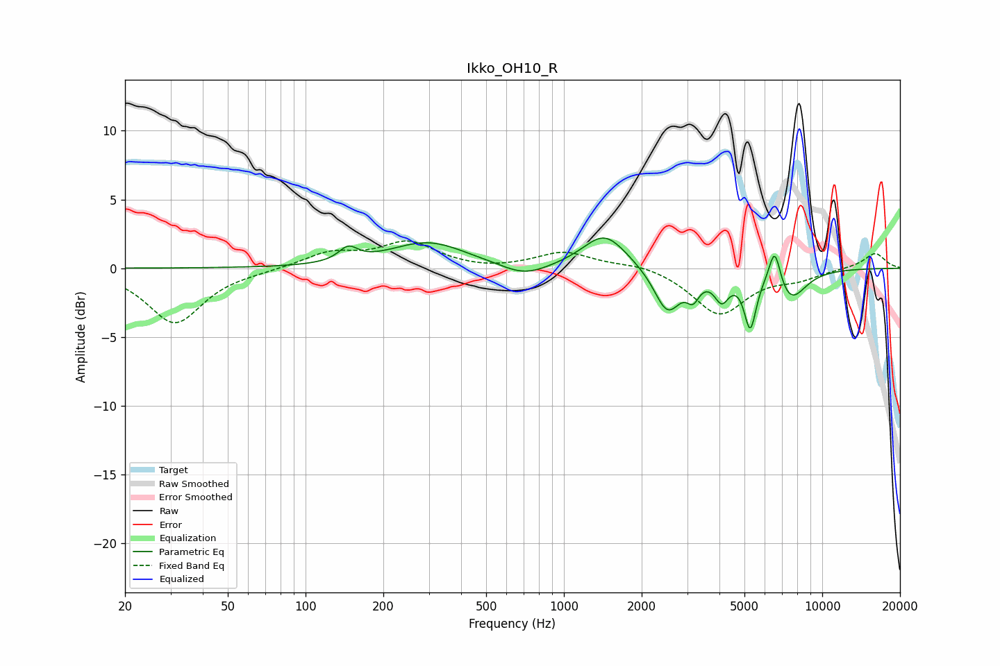

# Ikko_OH10_R
See [usage instructions](https://github.com/jaakkopasanen/AutoEq#usage) for more options and info.

### Parametric EQs
Apply preamp of -2.3 dB when using parametric equalizer.

|   # | Type    |   Fc (Hz) |    Q |   Gain (dB) |
|-----|---------|-----------|------|-------------|
|   1 | Peaking |       146 | 3.92 |         1   |
|   2 | Peaking |       298 | 0.95 |         1.9 |
|   3 | Peaking |       704 | 1.54 |        -0.9 |
|   4 | Peaking |      1438 | 1.67 |         2.5 |
|   5 | Peaking |      2516 | 2.75 |        -3.2 |
|   6 | Peaking |      3162 | 5.87 |        -1.3 |
|   7 | Peaking |      4082 | 4.92 |        -1.8 |
|   8 | Peaking |      5264 | 6    |        -3.9 |
|   9 | Peaking |      6547 | 6    |         2.8 |
|  10 | Peaking |      7545 | 2.27 |        -2.2 |

### Fixed Band EQs
When using fixed band (also called graphic) equalizer, apply preamp of **-2.1 dB** (if available) and set gains manually with these parameters.

|   # | Type    |   Fc (Hz) |    Q |   Gain (dB) |
|-----|---------|-----------|------|-------------|
|   1 | Peaking |        31 | 1.41 |        -4   |
|   2 | Peaking |        62 | 1.41 |        -0.1 |
|   3 | Peaking |       125 | 1.41 |         1.1 |
|   4 | Peaking |       250 | 1.41 |         1.8 |
|   5 | Peaking |       500 | 1.41 |        -0.2 |
|   6 | Peaking |      1000 | 1.41 |         1.2 |
|   7 | Peaking |      2000 | 1.41 |         0.4 |
|   8 | Peaking |      4000 | 1.41 |        -3.3 |
|   9 | Peaking |      8000 | 1.41 |        -0.6 |
|  10 | Peaking |     16000 | 1.41 |         1.1 |

### Graphs

