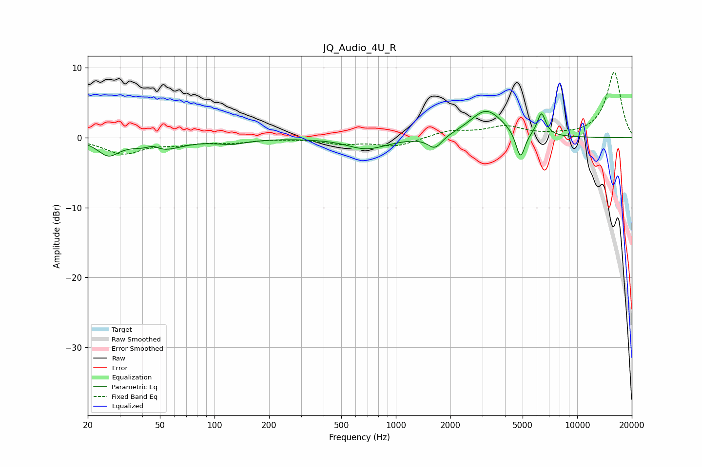

# JQ_Audio_4U_R
See [usage instructions](https://github.com/jaakkopasanen/AutoEq#usage) for more options and info.

### Parametric EQs
Apply preamp of -3.9 dB when using parametric equalizer.

|   # | Type    |   Fc (Hz) |    Q |   Gain (dB) |
|-----|---------|-----------|------|-------------|
|   1 | Peaking |        26 | 2.47 |        -2.2 |
|   2 | Peaking |        46 | 4.09 |         0.8 |
|   3 | Peaking |        49 | 1.26 |        -1.8 |
|   4 | Peaking |       124 | 1.63 |        -0.7 |
|   5 | Peaking |       508 | 1.38 |         0.2 |
|   6 | Peaking |       682 | 1.22 |        -1.7 |
|   7 | Peaking |      1642 | 3.62 |        -1.8 |
|   8 | Peaking |      3153 | 1.55 |         4   |
|   9 | Peaking |      4866 | 5.6  |        -4   |
|  10 | Peaking |      6351 | 5.85 |         3.2 |

### Fixed Band EQs
When using fixed band (also called graphic) equalizer, apply preamp of **-9.5 dB** (if available) and set gains manually with these parameters.

|   # | Type    |   Fc (Hz) |    Q |   Gain (dB) |
|-----|---------|-----------|------|-------------|
|   1 | Peaking |        31 | 1.41 |        -2.2 |
|   2 | Peaking |        62 | 1.41 |        -0.7 |
|   3 | Peaking |       125 | 1.41 |        -0.6 |
|   4 | Peaking |       250 | 1.41 |        -0   |
|   5 | Peaking |       500 | 1.41 |        -0.8 |
|   6 | Peaking |      1000 | 1.41 |        -1.2 |
|   7 | Peaking |      2000 | 1.41 |         1   |
|   8 | Peaking |      4000 | 1.41 |         1.5 |
|   9 | Peaking |      8000 | 1.41 |         0.2 |
|  10 | Peaking |     16000 | 1.41 |         9.4 |

### Graphs

